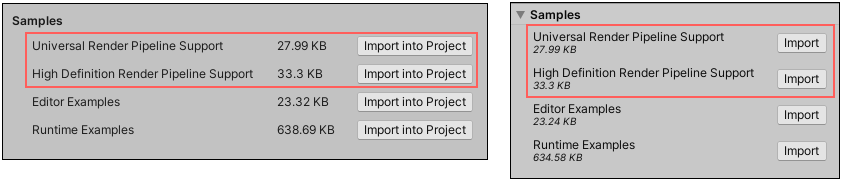

# Installing ProBuilder

From version 3.0 and onwards, ProBuilder is only available from the Package Manager.

To install this package, follow the instructions in the [Package Manager documentation](https://docs.unity3d.com/Manual/upm-ui-install.html).

## Support for scriptable render pipelines

If you are using either the [Universal Render Pipeline](https://docs.unity3d.com/Manual/universal-render-pipeline.html) (URP) or the [High Definition Render Pipeline](https://docs.unity3d.com/Manual/high-definition-render-pipeline.html) (HDRP), you also need to import the corresponding URP or HDRP Shaders needed to display vertex colors and textures correctly.

To import these Shaders from the **Samples** section:

1. Open the Package Manager (**Window** > **Package Manager**) inside the Unity Editor and select the ProBuilder package from the list of packages.

2. Find the **Samples** section near the bottom of the package details. In some versions of the Unity Editor, the Package Manager collapses the **Samples** section by default, so you may have to expand it to see the support entries.

	 

3. Click the button next to the support entry that matches the render pipeline you are using.

  The Project view now displays the support folder containing the imported files under the `Assets/Samples/ProBuilder/<version>` folder of your project.

## Compatibility with Unity versions

This version of ProBuilder is only compatible with Unity version 2019.4 and later. 

