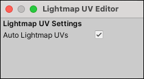

#  Lightmap UV Editor window

The Lightmap UV Editor window contains the __Auto Lightmap UVs__ setting. Use this to set whether or not you want ProBuilder to automatically rebuild lightmap UVs every time the Mesh changes for this Project. You can also toggle this setting on the [ProBuilder Preferences window](preferences.md#autouvs).

To open this window, launch the [toolbar option](toolbar.md#pb_options) on the **Lightmap UVs** button ( ) from the [ProBuilder toolbar](toolbar.md).

> **Tip:** You can also access this window from the ProBuilder menu (**Tools** > **ProBuilder** > **Editors** > **Open Lightmap UV Editor**).

This is a useful setting to enable, because it removes the process of manually building lightmap UVs. However, it can also be resource-intensive, especially for older or less powerful systems. If __Auto Lightmap UVs__ has a significant impact on performance, it might be more efficient to disable __Auto Lightmap UVs__ and just use the [Lightmap UVs](Object_LightmapUVs.md) action ( ) when you need it.

> **Tip:** When one of the Meshes in any open scene is missing lightmap UVs, the **Lightmap UV Settings** window displays a warning message and the **Build Missing Lightmap UVs** button. When you click the button, ProBuilder builds the lightmap UVs and then hides the button and the message.
