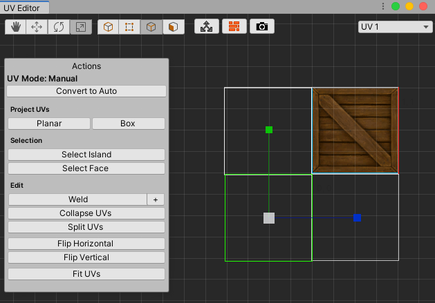
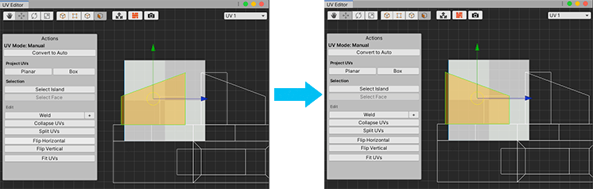
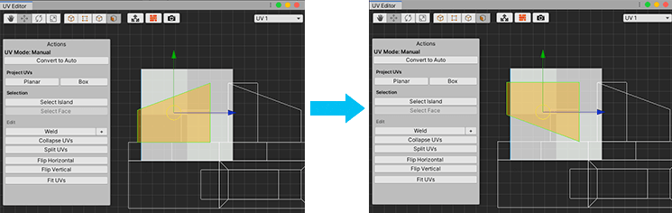

# Actions panel: Manual UV Mode

In Manual mode, the **Actions** panel displays the **UV Mode: Manual** label and helpers for manual UV manipulation. The Manual mode provides the following functionality to help you with texture mapping:

* The [Project UVs](#Project) section provides different UV projection methods.
* The [Selection](#Selection) section allows you to expand which UV elements are selected.
* The [Edit](#Edit) section provides manipulation functionality.

To access this panel, either click the **Convert to Manual** button from the [Actions panel in Auto UV Mode](auto-uvs-actions.md), or  click the  **UV Vertex** or  **UV Edge** [edit mode buttons](edit-mode-toolbar.md).

> **Tip:** If you get to the point where you have been making a lot of edits and something seems wrong but you're not sure how to fix it, you can clear all the edits. To do this, navigate to the **UV Mode: Auto** Actions panel and click the **Reset UVs** button.

To switch back to the **Actions** panel in **Auto UV Mode** and convert all selected faces to [Auto UVs](auto-uvs-actions.md), click the **Convert to Auto** button.

> **Tip:** Before you start to manipulate UVs manually, make sure you delete any faces that you don't need. For example, if you have a box that is sitting against the wall and doesn't move, delete the face pressed up against the wall. It is a waste of resources to render faces that aren't visible.

## Project UVs

Select how you want ProBuilder to project the UVs: using the **Planar** or **Box** projection method.

### Planar

Unwraps the selected face(s) using a Planar projection method.

Planar projection draws the texture on an entire image as if it is projected from a single plane. That is, image travels perpendicularly from the virtual projection plane onto the surface.

### Box

Unwraps the selected face(s) using a Box projection method.

Box projection is like applying planar projection from all six planes at once. This type of projection is ideal for boxes and other 3-dimensional flat objects.

## Selection

There are two selection helpers you can use to expand which UV elements are selected: **Select Island** and **Select Face**.

### Select Island

With a UV element selected, click this to expand the selection so that it includes all other connected UV elements.

### Select Face

With a Vertex or Edge selected, click to select all elements on the same face.

## Edit

ProBuilder provides a number of manual manipulation features for working in the UV Editor: [welding](#Weld) vertices; [splitting](#Split) and [collapsing](#Collapse) UVs; flipping UV elements [horizontally](#Horizontal) and [vertically](#Vertical); and [resizing](#Fit) UV elements to match the UV space.

### Weld

**Weld** collapses selected vertices together, but only if they are within a set distance.

To adjust the distance modifier, click the **+** button on the right side of the **Weld** button.

For example, it is good practice to use a low value, such as 0.01. Then you can select all of the UVs at the same time and use **Weld** to reduce duplicate UV vertices. This is an important step if you are planning on autostitching, because it requires faces to be adjacent, and duplicate edges produce undesired results.

### Collapse UVs

**Collapse UVs** collapses all selected vertices to a single vertex, regardless of distance.

### Split UVs

**Split UVs** breaks off the selected UV element(s) from any UV element(s), so that you can manipulate them independently.

### Flip Horizontal

**Flip Horizontal** flips the selected UV element(s) in the horizontal direction.

### Flip Vertical

**Flip Vertical** flips the selected UV element(s) in the vertical direction.

### Fit UVs

Use **Fit UVs** to scale and move the selected UV element(s) to fit them exactly within the UV space.

### Autostitching

Usually, to unwrap UV faces, you need to manually position each one individually and weld the UV vertices together. **Autostitching** performs this automatically.

You can autostitch any two adjacent faces together. To do this, follow this procedure:

1. Select a face in the Scene view.

2. Open the UV Editor window and switch to UV Face editing mode.

3. Select a face on the Mesh and then **Ctrl+Click** a face that shares an edge with the current selection.

	> **Important:** Use the **Ctrl** key for both macOS and Windows.

4. You can continue to **Ctrl+Click** one face at a time as long as it is adjacent to the selected face.

Autostitching allows you to control how ProBuilder projects the Texture image across the Mesh. It is like building a UV quilt that uses [planar projection](#Project).

### Copy UVs

You can copy UVs from one face to another. For example, if you are working on a barrel and you want to copy the UVs from the top face to the bottom, follow these steps:

1. Open the UV Editor. ProBuilder can only perform UV editing tasks when the UV Editor is open.  

2. In the Scene view, select the face you want to copy from.

3. **Ctrl+Shift+Click** on the face you want to copy to.

	> **Important:** Use the **Ctrl** key for both macOS and Windows.

4. You can continue to **Ctrl+Shift+Click** each face you want to copy to.
