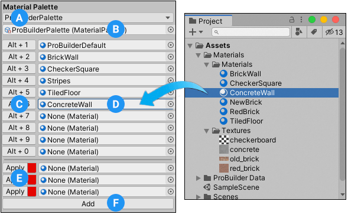

#  Material Editor window

Use the **Material Editor** to apply Materials to objects or faces.

**(A)** Use the [Quick Material](#quick) section to set up a Material to apply with a button or a shortcut.

**(B)** Use the [Material Palette](#palette) section to designate several Materials to use with buttons or shortcuts. You can also save and load new Palettes, and add more slots to use for Materials.

To open this window, navigate to the [ProBuilder toolbar](toolbar.md) and click the **Material Editor** button (  ).

> **Tip:** You can also access this window from the ProBuilder menu (**Tools** > **ProBuilder** > **Editors** > **Open Material Editor**).

For an overview of working with Materials and texture mapping, see [Materials, Shaders, Textures, and UVs](workflow-texture-mapping.md).

## Quick Material

The **Quick Material** section allows you to specify a Material to apply with either the shortcut combination or the **Apply** button.

**(A)** You can [set a reference to the Material](#qset) to use as the "quick" Material.

**(B)** ProBuilder shows a preview when you set a quick Material.

> **Note:** If you are working in Windows, this preview might not appear.

**(C)** With a quick Material defined, any time you click **Apply**, ProBuilder [applies the quick Material](#qapply) to the selected faces. Alternatively, you can hold down **Ctrl/Cmd+Shift** and click on a face to apply the quick Material to the clicked face.

**(D)** Click **Match Selection** to change the quick Material to match the Material that is already on the selected face.

### Setting a quick Material

To set a quick Material, set a reference to a Material Asset you want to use as the quick Material. You can drag in the Asset from the Project view or use the object picker next to the reference property.

If there's a face on a GameObject in the scene that is already using the Material you want to set as quick, select that face and click the **Match Selection** button.

### Applying the quick Material

To apply the quick Material:

1. Select the object or face(s) you want to apply the quick Material to.
2. Click the **Apply** button or use the **Ctrl/Cmd+Shift+Click** shortcut combination.

## Material Palette

A Material Palette is a convenient way to keep several Materials ready to apply, either with the Material Editor or with shortcut combinations.

You can set up to 10 different Materials on the Palette, or expand the slots in your Palette if you need more.

You can also save your Palette as a custom Palette and load it in other Scenes or sessions to use it again.

**(A)** Create a new Material Palette or select a saved Palette to load from the Palette drop-down menu.

**(B)** Set a reference to the Material Palette you want to load.

**(C)** Use one of the buttons to apply the associated Material to the selected face(s). Alternatively, you can use the shortcut displayed on the button (**Alt/Opt+&lt;number&gt;**) or select the preset from the ProBuilder menu (**Tools** > **ProBuilder** > **Materials** > **Apply Material Preset &lt;number&gt;**).

**(D)** Set a reference to the Material you want to use in this slot of the Material Palette.

**(E)** To delete an extra slot, click the red square on the right edge of the button.

**(F)** Click **Add** to add a new slot to the Material Palette.

### Defining Materials on a Palette

To set Materials on your Palette, set a reference to a Material Asset you want to use in a specific Material slot. You can drag in the Asset from the Project view or use the object picker next to the reference property.

### Applying Material from the Palette

To apply a specific Material from the Palette:

1. Select the object or face(s) you want to apply the Material to.
2. Click the button to the left of the Material you want to apply. For example, if you want to apply the Material in the third slot, click the button that displays **Alt + 3**.

> **Tip:** You can find the number of the Material preset on each slot's button. Then you can use that number to apply its Material directly using either of these methods:
>
> * Use the **Alt/Opt+#** shortcut.
> * Select the Material preset from the ProBuilder menu (**Tools** > **ProBuilder** > **Materials** > **Apply Material Preset #**).

### Defining your own Material slots in your Palette

By default, the Material Palette provides 10 slots (numbered 1 to 0) for your Materials. However, if you need to add more slots to your Palette, you can add any number of extra slots using this procedure:

1. Click the **Add** button at the bottom of the **Material Editor** window.

  A new slot appears with an **Apply** button on the left and the Material picker on the right.

2. Pick your new Material to use in the new slot.

> **Note:** You can't set up new shortcuts for the new slots but you can click their buttons in the Material Editor to apply them.

To remove any extra slots from your Palette:

* Click the red square on the right side of the **Apply** button.

### Saving a custom Palette

To save the current Palette to an Asset file:

1. In the **Material Palette** drop-down menu, select **New Material Palette**.

	A new file with the default name of `Material Palette.asset` appears under the `Assets` folder in the **Project** view.

2. (Optional) Change the filename to something that helps you identify it for future use.

> **Warning:** As soon as you make a change to your Material Palette, ProBuilder automatically saves it to the Palette.

### Loading a custom Palette

All Material Palette Asset files in the current Project appear as menu items in the **Material Palette** drop-down menu in the **Material Editor** window.

To load a saved Material Palette from file:

* Select the saved palette by name from the **Material Palette** drop-down menu.
