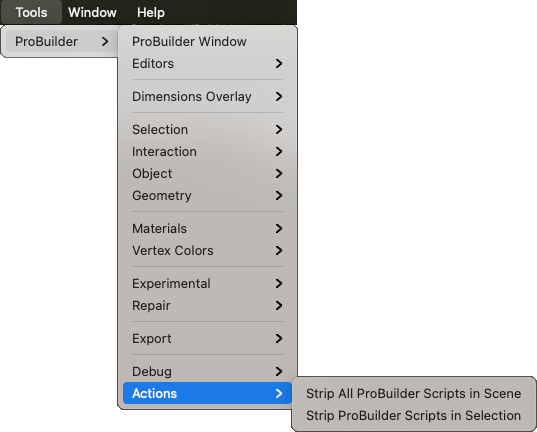

# Actions

Use this sub-menu to access helper functions for stripping out ProBuilder scripts.

## Strip All ProBuilder Scripts in Scene

Removes all ProBuilder scripts from all GameObjects in this scene, and only leaves the models.

## Strip ProBuilder Scripts in Selection

Removes all ProBuilder scripts from selected GameObjects, and only leaves the models.
