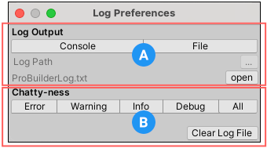

# Debug

Use this sub-menu to access the **Log Preferences** window. 

Use the **Log Preferences** window to customize how ProBuilder logs messages. The darker color indicates that the setting is enabled (ON); the lighter color indicates that the setting is disabled (OFF).

**(A)** [Log Output](#output) defines where ProBuilder writes messages to.

**(B)** [Chatty-ness](#chattyness) defines which kind of messages ProBuilder logs.

## Log Output

__Log Output__ defines where ProBuilder writes messages to: the Unity __Console__ or to a log __File__:

* Click the __Console__ button to enable writing to the Console. 
* Click the __File__ button to enable writing to a file. When the **File** output target is enabled, the **Log Path** widget and the **open** button are enabled.
* To set the __Log Path__, click the __...__ button and select a folder for the log file. This widget is only available if the **File** button is ON.
* Click the **open** button to open the saved __ProBuilderLog.txt__ log file. This button is only available if the **File** button is ON.

By default, ProBuilder writes messages only to the __Console__.

## Chatty-ness

The __Chatty-ness__ section defines which kind of messages ProBuilder logs: 

* Toggle whether or not ProBuilder logs messages about the following: **Errors**, **Warnings**, **General information**, **Debug messages**, or everything. By default, ProBuilder logs everything, and these buttons are all ON.
* Click the __Clear Log File__ button to reset the saved log file. This deletes all messages that ProBuilder previously logged.

