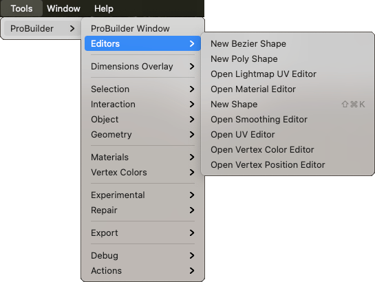

# Editors

This sub-menu provides access to tools and editor windows.

## New Bezier Shape

Use the **Bezier Shape** tool to define a Bezier curve around which ProBuilder extrudes a Mesh.

> **Warning:** This tool is experimental, meaning that it is still under development, and might reduce ProBuilder's stability. Use with caution.

For more information, see the [Bezier Shape tool](bezier.md) documentation.

## New Poly Shape

Use the **Poly Shape** tool to create custom ProBuilder Mesh shapes.

For more information, see the [Poly Shape tool](shape-tool.md) documentation.

## Open Lightmap UV Editor

Use the **Lightmap UV Editor** window to access the settings for generating light map UVs.

For more information, see the [Lightmap UV Editor](lightmap-uv.md) window documentation.

## Open Material Editor

Use the **Material Editor** window to apply materials to objects or faces.

For more information, see the [Material Editor](material-tools.md) window documentation.

## New Shape

Use the **New Shape** tool to create new ProBuilder Mesh shapes such as cylinders, arches, and stairs.

For more information, see the [Shape tool](shape-tool.md) documentation.

## Open Smoothing Editor

Use the **Smooth Group Editor** window to create a smooth and rounded look, or sharp and hard cornered.

For more information, see the [Smooth Group Editor](smoothing-groups.md) window documentation.

## Open UV Editor

Use the **UV Editor** window to apply textures to objects or faces. You can also use it to automatically or manually wrap and unwrap textures.

For more information, see the [UV Editor](uv-editor.md) window documentation.

## Open Vertex Color Editor

Use the **Vertex Colors** window to apply or paint vertex colors onto Meshes.

For more information, see the [Vertex Colors](vertex-colors.md) window documentation.

## Open Vertex Position Editor

Use the **Positions Editor** window to enter specific translation coordinates to modify vertex positions.

For more information, see the [Positions Editor](vertex-positions.md) window documentation.
