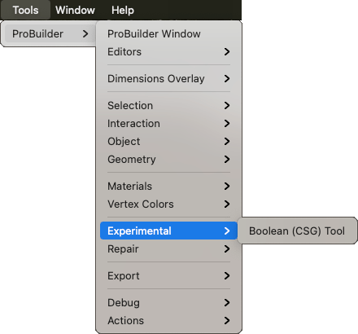

# Experimental

This sub-menu provides access to experimental features.

> **Note**: This sub-menu is only available when you enable the [experimental features preference](preferences.md#experimental).

Experimental features aren’t ready for public use, but are included for users to try out early, and report issues/feedback. 

## Boolean (CSG) Tool

The [Boolean](boolean.md) feature is the only option available on this sub-menu. It lets you create new Meshes from intersection, union, and subtraction boolean operations.

