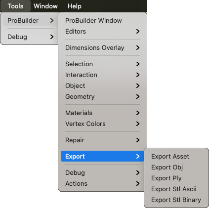

# Export

Use this sub-menu to [export selected ProBuilder Meshes](workflow-exporting.md) in various formats. 

> **Tip:** When you perform an export using one of these menu items, Unity uses the default export options for the specific format. If you want to view or change the default export options, **Alt/Opt+Click** over the **Export** button on the ProBuilder toolbar.

## Export Asset

Saves the selection as Unity Mesh `.asset` files. This format is only readable in Unity.

## Export Obj

Exports the selected object(s) as `.obj` files (Wavefront OBJ format). This is a widely supported model format. It supports multiple Textures and Mesh groups.

## Export Ply

Exports the selected object(s) as `.ply` files (Stanford PLY, or Polygon File Format). This format is generally supported and very extensible. It supports quads and vertex colors, but not multiple materials.

## Export Stl Ascii

Exports the selected object(s) as ASCII `.stl` files (stereolithography, standard tessellation, or standard triangle format). This is a widely supported format, generally used in CAD software or 3D printing. It only supports Triangle geometry.

## Export Stl Binary

Exports the selected object(s) as Binary `.stl` files (stereolithography, standard tessellation, or standard triangle format). This is a widely supported format, generally used in CAD software or 3D printing. It only supports Triangle geometry.

