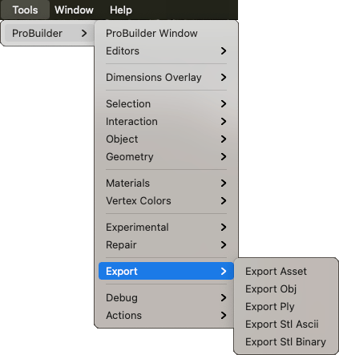

# Export

## Export Asset

Saves the selection as Unity Mesh `.asset` files.

## Export Obj

Exports the selected object(s) in the OBJ format.

## Export Stl Ascii

Exports the selected object(s) in the STL ASCII format.

## Export Stl Binary

Export the selected object(s) as STL in Binary format.
