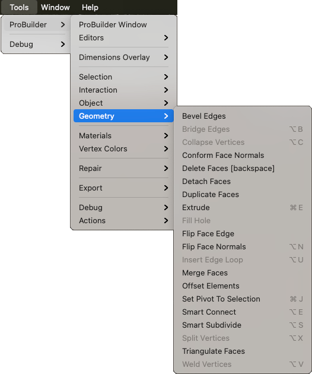

# Geometry

This sub-menu provides access to Vertex, Edge, and Face edit mode actions.

## Bevel Edges

Use the **Bevel** action to [bevel](Edge_Bevel.md) every edge on the selected face(s).

For more information, see the [Bevel](Face_Bevel.md) action documentation.

## Bridge Edges

Use the **Bridge Edges** action to create a new face between two selected edges. 

For more information, see the [Bridge Edges](Edge_Bridge.md) action documentation.

## Collapse Vertices

Use the **Collapse Vertices** action to colapse all selected vertices to a single point, regardless of distance. 

For more information, see the [Collapse Vertices](Vert_Collapse.md) action documentation.

## Conform Face Normals

Use the **Conform Normals** action to set all selected face normals to the same relative direction. 

For more information, see the [Conform Normals](Face_ConformNormals.md) action documentation.

## Delete Faces

Use the **Delete Faces** action to delete the selected face(s).

For more information, see the [Delete Faces](Face_Delete.md) action documentation.

## Detach Faces

Use the **Detach Faces** action to detach the selected face(s) from the rest of the Mesh.

For more information, see the [Detach Faces](Face_Detach.md) action documentation.

## Duplicate Faces

Use the **Duplicate Faces** action to copy each selected face and move it to either a new Mesh or leave it as a sub-Mesh.

For more information, see the [Duplicate Faces](Face_Duplicate.md) action documentation.

## Extrude

In Edge edit mode, use the **Extrude Edges** action to push a new edge out from each selected edge.

In Face edit mode, use the **Extrude Faces** action to pull out the currently selected face and attach sides to each edge.

For more information, see the documentation for the [Extrude Edges](Edge_Extrude.md) and the [Extrude Faces](Face_Extrude.md) actions.

## Fill Hole

In Vertex and Edge edit modes, use the **Fill Hole** action to create a new face that fills any holes that touch the selected vertices or edges.

For more information, see the documentation for the [Fill Hole (vertices)](Vert_FillHole.md) and [Fill Hole (edges)](Edge_FillHole.md) actions.

## Flip Face Edge

Use the **Flip Face Edge** (**Turn Edges**) action to swap the triangle orientation on the selected face(s) with four sides.

For more information, see the [Flip Face Edge](Face_FlipTri.md) action documentation.

## Flip Face Normals

Use the **Flip Face Normals** action to flip the normals only on the selected face(s).

For more information, see the [Flip Face Normals](Face_FlipNormals.md) action documentation.

## Insert Edge Loop

Use the **Insert Edge Loop** action to add a new edge loop from the selected edge(s). 

For more information, see the [Insert Edge Loop](Edge_InsertLoop.md) action documentation.

## Merge Faces

Use the **Merge Faces** action to merge selected faces into a single face, and remove any dividing edges.

For more information, see the [Merge Faces](Face_Merge.md) action documentation.

## Offset Elements

In Vertex edit mode, use the **Offset Elements** action to move the selected vertex or vertices.

In Edge edit mode, use the **Offset Elements** action to move the selected edge(s).

In Face edit mode, use the **Offset Elements** action to move the selected face(s).

For more information, see the [Offset Elements](Offset_Elements.md) action documentation.

## Set Pivot To Selection

Use the **Set Pivot** action to move the pivot point of this Mesh to the average center of the selected faces.

For more information, see the [Set Pivot](Face_SetPivot.md) action documentation.

## Smart Connect

In Vertex edit mode, use the **Connect Vertices** action to create a new edge connecting the selected vertices.

In Edge edit mode, use the **Connect Edges** action to insert an edge connecting the centers of each selected edge.

For more information, see the documentation for the [Connect Vertices](Vert_Connect.md) and [Connect Edges](Edge_Connect.md) actions.

## Smart Subdivide

In Edge edit mode, use the **Subdivide Edges** action to divide the selected edge(s) into multiple edges. 

In Face edit mode, use the **Subdivide Faces** action to add a vertex at the center of each edge and connect them in the center.

For more information, see the documentation for the [Subdivide Edges](Edge_Subdivide.md) and [Subdivide Faces](Face_Subdivide.md) actions.

## Split Vertices

Use the **Split Vertices** action to split a single vertex into multiple vertices (one per adjacent face).

For more information, see the [Split Vertices](Vert_Split.md) action documentation.

## Triangulate Faces

Use the **Triangulate Faces** action to reduce selected faces to their base triangles.

For more information, see the [Triangulate Faces](Face_Triangulate.md) action documentation.

## Weld Vertices

Use the **Weld Vertices** action to merge selected vertices within a specific distance of one another.

For more information, see the [Weld Vertices](Vert_Weld.md) action documentation.

