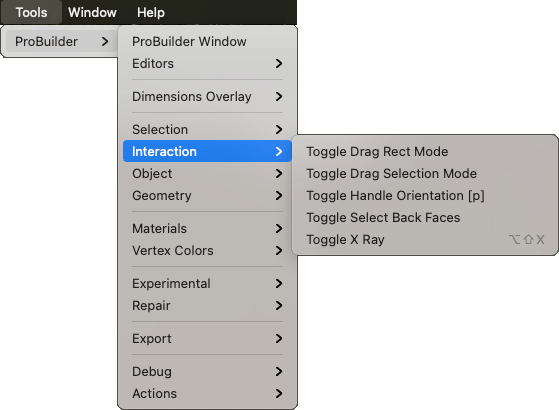

# Interaction

This sub-menu provides access to selection interaction actions.

## Toggle Drag Rect Mode

Use this to set the **Rect** action to **Complete**. This means that drag selection only selects elements that are fully inside the drag rectangle.

For more information, see the [Rect](Selection_Rect_Intersect.md) action documentation.

## Toggle Drag Selection Mode

Use this to set the **Rect** action to **Intersect**. This means that drag selection selects any elements that intersect with the drag rectangle.

For more information, see the [Rect](Selection_Rect_Intersect.md) action documentation.

## Toggle Select Back Faces

Use the **Select Hidden** action to define whether drag selection selects or ignores hidden elements.  

For more information, see the [Select Hidden](Selection_SelectHidden.md) action documentation.

