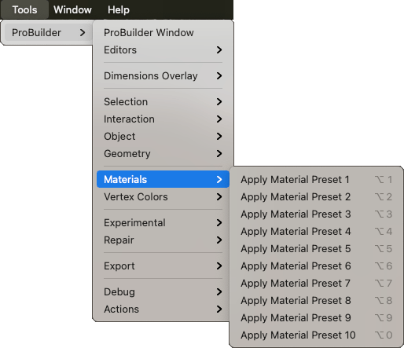

# Materials

Use this sub-menu to apply specific Material presets to the selection.

Select the specific Material preset defined on the [Material Editor window](material-tools.md) to [set the associated Material](materials-tools.md#apply) on the selected object(s) or element(s).

