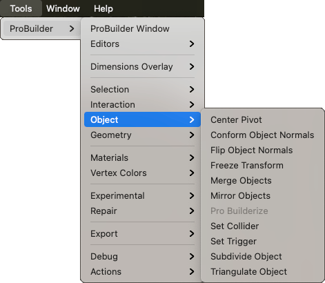

# Object

This sub-menu provides access to Object edit mode actions.

## Center Pivot

Use the **Center Pivot** action to move the pivot point for the Mesh to the center of the object’s bounds.

For more information, see the [Center Pivot](CenterPivot.md) action documentation.

## Conform Object Normals

Use the **Conform Normals** action to set all face normals to the same relative direction.

For more information, see the [Conform Normals](Object_ConformNormals.md) action documentation.

## Flip Object Normals

Use the **Flip Normals** action to flip the normals of **all** faces on the selected object(s).

For more information, see the [Flip Normals](Object_FlipNormals.md) action documentation.

## Freeze Transform

Use the **Freeze Transform** action to set the selected object's position, rotation, and scale to world-relative origin.

For more information, see the [Freeze Transform](Freeze_Transform.md) action documentation.

## Merge Objects

Use the **Merge Objects** action to merge two or more selected ProBuilder GameObjects.

For more information, see the [Merge Objects](Object_Merge.md) action documentation.

## Mirror Objects

Use the **Mirror Objects** action to create mirrored copies of objects.

For more information, see the [Mirror Objects](Object_Mirror.md) action documentation.

## Pro Builderize

Use the **ProBuilderize** action to convert the selected object(s) into objects you can edit in ProBuilder.

For more information, see the [ProBuilderize](Object_ProBuilderize.md) action documentation.

## Set Collider

Use the **Set Collider** action to assign the **Collider Behaviour** script to selected objects.

For more information, see the [Set Collider](Entity_Trigger.md#Collider) action documentation.

## Set Trigger

Use the **Set Trigger** action to assign the **Trigger Behaviour** script to selected objects.

For more information, see the [Set Trigger](Entity_Trigger.md) action documentation.

## Subdivide Object

Use the **Subdivide Object** action to divide every face on selected objects.

For more information, see the [Subdivide Object](Object_Subdivide.md) action documentation.

## Triangulate Object

Use the **Triangulate Object** action to reduce all polygons to their base triangles.

For more information, see the [Triangulate](Object_Triangulate.md) action documentation.
