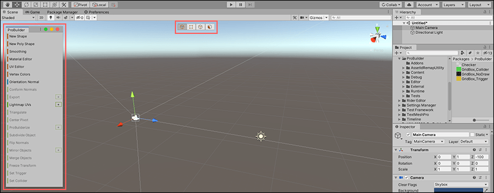

# ProBuilder Window

This opens the [ProBuilder toolbar](toolbar.md) and [Edit mode toolbar](edit-mode-toolbar.md) together. 

By default, the Edit mode toolbar appears in the upper center of your Unity workspace, and the ProBuilder toolbar appears on the left side. See [Customizing ProBuilder](customizing.md) for information on how to customize the location and appearance of these toolbars and other ProBuilder windows.