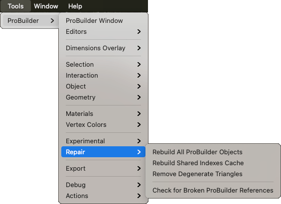

# Repair

Use this sub-menu to access several helper scripts that repair problems with ProBuilder Meshes in the Scene.

## Rebuild All ProBuilder Objects

Rebuilds Mesh representations from stored ProBuilder data for each GameObject in the Scene. If you have a lot of GameObjects in a Scene, this can take a while.

## Rebuild Shared Indexes Cache

Discards all shared vertex position data and rebuilds based on proximity.

## Remove Degenerate Triangles

Deletes triangles on a Mesh that are either taking up no space, or are duplicates.

## Convert to Package Manager

Use this script if you are upgrading an older ProBuilder project to this version. <!-- See [Upgrading from older versions of ProBuilder](installing.md) for more information. -->
