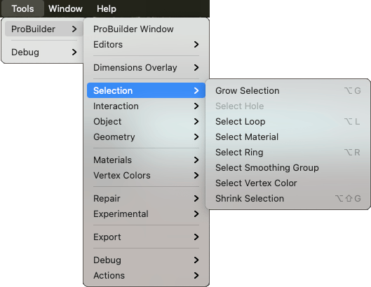

# Selection

This sub-menu provides access to selection modifiers and actions.

## Grow Selection

Use the **Grow Selection** action to expand the selection outward to adjacent faces, edges, or vertices.

For more information, see the [Grow Selection](Selection_Grow.md) action documentation.

## Select Hole

Use the **Select Holes** action to select all elements along the selected open vertex or edge.

For more information, see the [Select Holes](Selection_SelectHole.md) action documentation.

## Select Loop

In Edge editing mode, use the [Select Edge Loop](Selection_Loop_Edge.md) action to select an edge loop from each selected edge.

In Face editing mode, use the [Select Face Loop](Selection_Loop_Face.md) action to select a face loop from each selected face.

## Select Material

Use the **Select by Material** action to select all faces which have the same Material as the selected face(s). 

For more information, see the [Select by Material](Selection_SelectByMaterial.md) action documentation.

## Select Ring

In Edge editing mode, use the [Select Edge Ring](Selection_Ring_Edge.md) action to select a ring from each selected edge.

In Face editing mode, use the [Select Face Ring](Selection_Ring_Face.md) action to select a face ring from each selected face.

## Select Smoothing Group

Use the **Select Smoothing Group** action to select all faces which belong to the currently selected [smoothing group](smoothing-groups.md). 

For more information, see the [Select Smoothing Group](Selection_SmoothingGroup.md) action documentation.

## Select Vertex Color

Use the **Select by Colors** action to select all faces on this object which have the same vertex color as the selected face. 

For more information, see the [Select by Colors](Selection_SelectByVertexColor.md) action documentation.

## Shrink Selection

Use the **Shrink Selection** action to remove the elements on the perimeter of the current selection ([Grow Selection](Selection_Grow.md) in reverse).

For more information, see the [Shrink Selection](Selection_Shrink.md) action documentation.

