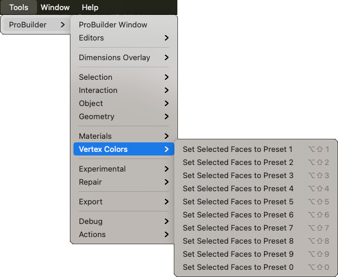

# Vertex Colors

Use this sub-menu to apply specific Vertex Color presets to the selection.

Select the specific vertex color preset defined on the [Vertex Colors window](vertex-colors.md) to [set the associated color](workflow-vertex.md#apply) on the selected object(s) or element(s).

