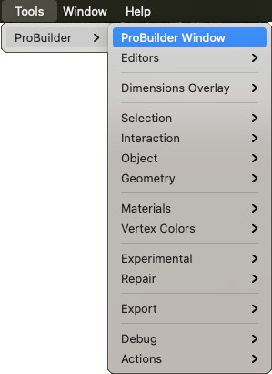

# The ProBuilder menu

Use the ProBuilder menu to access most of the ProBuilder editors, actions, tools, and a few special features that are only available through this menu. For example, you can repair and debug ProBuilder, or access the experimental [Boolean](boolean.md) Editor window. 

@DEVNOTE: Is the **Tools > Debug** menu entry permanent? If so, can you give me some context for these? Who are the users? What would you do with them? 

The ProBuilder menu items include the following:

* [ProBuilder Window](menu-open.md)
* [Editors](menu-editors.md)
* [Dimensions Overlay](menu-dimover.md)
* [Selection](menu-selection.md)
* [Interaction](menu-interaction.md)
* [Object](menu-object.md)
* [Geometry](menu-geometry.md)
* [Materials](menu-materials.md)
* [Vertex Colors](menu-vertexcolors.md)
* [Repair](menu-repair.md)
* [Experimental](menu-experimental.md) (only available when you enable the [experimental features preference](preferences.md#experimental))
* [Export](menu-export.md)
* [Debug](menu-debug.md)
* [Actions](menu-actions.md)

