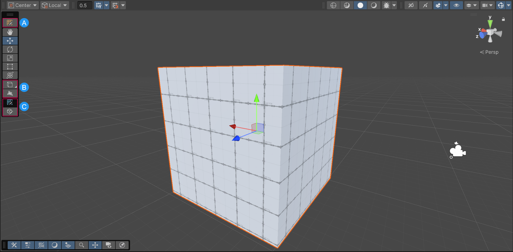
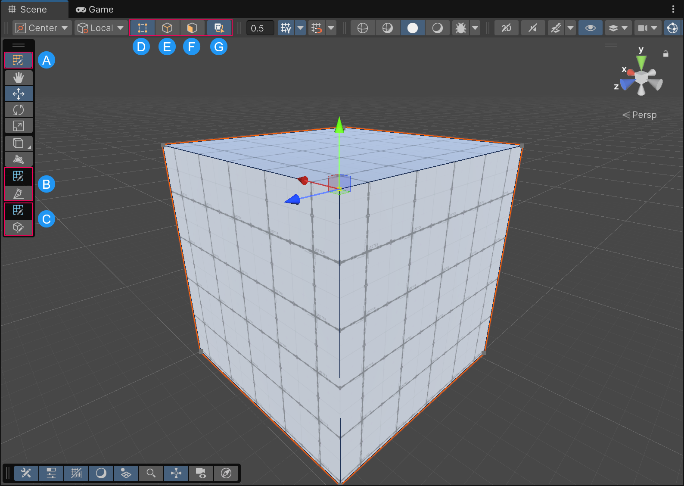

# Edit modes and active tool contexts

ProBuilder uses tool contexts and their dependent edit modes to display tools that are relevant to your current selection. 

You can use ProBuilder tools in two tool contexts: 

* [The GameObject context](#the-gameobject-context)
* [The ProBuilder context](#the-probuilder-context)

To change the tool context of your current selection, in the **Tools** overlay, select the **Tool Context** at the top of the overlay.

> [!TIP]
> To check which overlays are available in the Scene view, press the **`** key to open the Overlay menu. You can also open the Overlay menu from the More (⋮) menu in the top right corner of the Scene view. You can also use the Overlays menu overlay to quickly toggle the visibility of all the overlays in the Scene view.

## The GameObject context

Use the GameObject context to control the entire mesh. The GameObject tool context is the default tool context in the Editor. The GameObject tool context is active when no other tool context is activated.   
    

* A: The active tool context. In this image, the GameObject context is active. This icon in the **Tools** overlay displays that the ProBuilder context is available, but it's not highlighted in blue so it's not active. 
* B: ProBuilder global tools. The project in this image has the ProBuilder package installed, so these tools are always available. If you do not have the ProBuilder package installed, these tools are not available.
* C: ProBuilder component tools. The GameObject selected in this image has a ProBuilder component attached to it, so the [**Edit ProBuilder Shape**](workflow-edit) tool is available. This component tool is available in both ProBuilder and GameObject tool contexts. 

## The ProBuilder context

You can use the ProBuilder context to access tools that control individual elements of the mesh. You can only activate the ProBuilder context if the GameObject you have selected has a ProBuilder component attached to it. The ProBuilder context is further divided into edit modes that define the elements of the mesh you are selecting and editing. 

To change edit modes within the ProBuilder context, in the **Tool Settings** overlay, select a mode. 

* A: The active tool context in the **Tools** overlay. In this image, the ProBuilder tool context is active, so the **Tool Settings** overlay has settings specific to ProBuilder displayed. To disable the ProBuilder context and return to the GameObject tool context, select this icon. 
* B: The Cut tool in the **Tools** overlay. To learn more, refer to [The Cut Tool](cut-tool).
* C: ProBuilder component tools in the **Tools** overlay. The GameObject selected in this image has a ProBuilder component attached to it, so the [**Edit ProBuilder Shape**](workflow-edit) tool is available. This component tool is available in both ProBuilder and GameObject tool contexts. 
* D: Vertex Selection edit mode in the **Tool Settings** overlay. Select vertices and perform detailed editing such as vertex splitting and connecting. For a complete list of actions you can perform in this mode, refer to [Vertex actions](vertex.md)
* E: Edge selection edit mode in the **Tool Settings** overlay. Select edges and perform semi-complex geometry editing, and edge loop modeling techniques. For a complete list of actions you can perform in this mode, refer to [Edge actions](edge.md).
* F: Face selection edit mode in the **Tool Settings** overlay, which is the active edit mode in this image. Select faces on an object to perform basic tasks like moving, extruding, or even deleting them. For a complete list of actions you can perform in this mode, refer to [Face actions](face.md).
* G: Hidden Element Selection setting in the **Tool Settings** overlay. To learn more, refer to [Select Hidden](Selection_SelectHidden).

## The ProBuilder context menu

To quickly access ProBuilder actions, right-click (macOS: **Ctrl**+click) on a ProBuilder object to open the context menu:

* In the GameObject context, the context menu's ProBuilder category lists actions that impact the mesh as a whole, such as Flip Normals and Export.
* In the ProBuilder context, the context menu lists actions that match your current selection and edit mode.

These actions are also available in the ProBuilder menu.

## Keyboard shortcut for edit modes and context

To change context or edit modes, use the following keyboard shortcuts:

* Press **Escape** to return from the ProBuilder context to the GameObject context.
* Press **G** to cycle through the ProBuilder edit modes.

For a list of all ProBuilder shortcuts, and to add or change shortcuts, go to **Edit** > **Shortcuts** (macOS: **Unity** > **Shortcuts**) and search for **ProBuilder**. 
