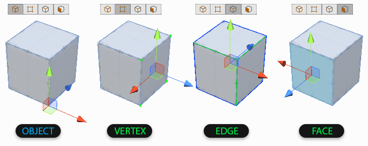
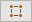

# Edit modes (Object vs Element)

ProBuilder uses **Edit modes** to define what you are selecting and editing.

The **Object** mode is the standard Unity edit mode: when you make a selection in Object mode, you are selecting the entire Mesh.

The other three modes are collectively called the **Element** modes. These allow you to select and modify the individual elements of the geometry that make up a Mesh: __Vertices__, __Edges__, and __Faces__.

* A __Vertex__ is a point where two or more angles meet (for example, on a cube, it's the corner point of each cube).
* An **Edge** is made up of two **Vertices**.
* A **Face** is composed of three or more **Edges**.

An __Object__ is the sum of all of these parts.

To change Edit modes, click one of the mode buttons on the [Edit mode toolbar](edit-mode-toolbar.md), or use a [mode shortcut key](hotkeys.md).

## Selecting and manipulating

Use the ProBuilder Edit modes to access the individual elements of your Mesh, or the Mesh as a whole.

1. Click the button that matches the object or element mode you'd like to edit in from the [Edit mode toolbar](edit-mode-toolbar.md).

  | **Icon Mode**                                          | **Description**                                              |
  | ------------------------------------------------------ | ------------------------------------------------------------ |
  |  | Select objects, modify the normals and the pivot, and merge objects together. For a complete list of actions you can perform in this mode, see [Object actions](object-actions.md). |
  |  | Select vertices and perform detailed editing such as vertex splitting and connecting. For a complete list of actions you can perform in this mode, see [Vertex actions](vertex.md). |
  |      | Select edges and perform semi-complex geometry editing, and edge loop modeling techniques. For a complete list of actions you can perform in this mode, see [Edge actions](edge.md). |
  |      | Select faces on an object to perform basic tasks like moving, extruding, or even deleting them. For a complete list of actions you can perform in this mode, see [Face actions](face.md). |

2. Click or drag to select the element you want to use.

3. With the object(s) or element(s) selected, you can:

  * Click one of the enabled buttons on the [ProBuilder toolbar](toolbar.md) to apply an action to the selection or activate a tool.
  * Select one of the enabled items on the [ProBuilder menu](menu.md) to apply an action to the selection or activate a tool.
  * Use one of the [ProBuilder shortcuts](hotkeys.md) to run one of the [ProBuilder actions](ref_actions.md) on the selection.
  * Use any of the standard Unity Transform controls to move, rotate, or scale the selection.
  * **Shift+Drag** while using any of the standard Unity Transform controls to extrude or inset the element(s).
