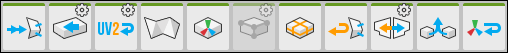

# Object Actions

This section of the ProBuilder toolbar provides access to ProBuilder editing tools that you can use in the [Object edit mode](modes.md).

> **Note:** Some actions also have extra options or custom settings available. These tool buttons have a special indicator in the top right corner. The documentation for each tool includes information about these options.

##  Triangulate

Use the **Triangulate** tool to reduce all polygons to their base triangles.

For more information, see the [Triangulate](Object_Triangulate.md) tool documentation.

##  Conform Normals

Use the **Conform Normals** tool to set all face normals to the same relative direction.

For more information, see the [Conform Normals](Object_ConformNormals.md) tool documentation.

##  Lightmap UVs

Use the **Lightmap UVs** tool to generate any missing lightmap UVs for Meshes.

For more information, see the [Lightmap UVs](Object_LightmapUVs.md) tool documentation.

##  Export

Use the **Export** tool to [export](workflow-exporting.md#export) the selected ProBuilder object(s) to a 3D Model file. 

For more information, see the [Export](Object_Export.md) tool documentation.

##  ProBuilderize

Use the **ProBuilderize** tool to convert the selected object(s) into objects you can edit in ProBuilder.

For more information, see the [ProBuilderize](Object_ProBuilderize.md) tool documentation.

##  Center Pivot

Use the **Center Pivot** tool to move the pivot point for the Mesh to the center of the object’s bounds.

For more information, see the [Center Pivot](CenterPivot.md) tool documentation.

##  Mirror Objects

Use the **Mirror Objects** tool to create mirrored copies of objects.

For more information, see the [Mirror Objects](Object_Mirror.md) tool documentation.

##  Merge Objects

Use the **Merge Objects** tool to merge two or more selected ProBuilder Meshes.

For more information, see the [Merge Objects](Object_Merge.md) tool documentation.

##  Flip Normals

Use the **Flip Normals** tool to flip the normals of **all** faces on the selected object(s).

For more information, see the [Flip Normals](Object_FlipNormals.md) tool documentation.

##  Freeze Transform

Use the **Freeze Transform** tool to set the selected object's position, rotation, and scale to world-relative origin.

For more information, see the [Freeze Transform](Freeze_Transform.md) tool documentation.

##  Subdivide Object

Use the **Subdivide Object** tool to divide every face on selected objects.

For more information, see the [Subdivide Object](Object_Subdivide.md) tool documentation.
