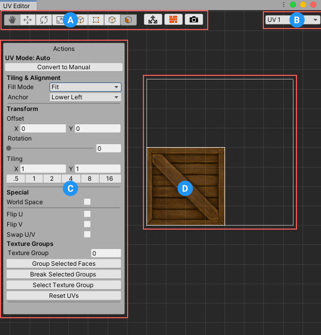

---

## Texture Mapping 101

**Texture Mapping** is the process of applying materials ("textures") to an object, and adjusting the Offset, Rotation, and Tiling of the object's UVs.

**UVs** are how the mesh stores this data. These are basically 2D "fold-outs" of the actual 3D mesh, like the image below.

## Auto vs Manual UVs

ProBuilder provides both "Automatic" and "Manual" Texturing methods:

* [Auto UVs](auto-uvs-actions) : Use this for simple Texturing work, especially architectural or hard-surface items. Tiling, Offset, Rotation, and other controls are available, while ProBuilder automatically handles projection and updates as you work.

* [Manual UV Editing](manual-uvs-actions) : Use a full UV Editor to precisely unwrap and edit UVs, render UV Templates, project UVs, and more.

You can use a mix of Auto and Manual UVs, even on the same object. This is especially useful when some parts of a model need to have tiling textures, while others are unwrapped.

## The UV Editor Window

Both [Auto-Texturing](auto-uvs-actions) and [Manual UV Editing](manual-uvs-actions) controls are located in UV Editor Window.

To open this window, click it's button (  or "UV Editor") in the [Main Toolbar](overview-toolbar).

###  UV Editor Toolbar

General tools and shortcuts for working with UVs- see the [UV Editor Toolbar](uv-editor-toolbar) section for details.

###  Actions Panel

This is a dynamic Panel, similar to the [Main Toolbar](overview-toolbar)- only actions available for the selected UV Element(s) type will be shown.

For full info, see the [Auto UVs Actions](auto-uvs-actions) and [Manual UVs Actions](manual-uvs-actions) sections.

###  UV Viewer

Here you can view and edit the selected object's UV Elements directly- see the [Manual UVs](manual-uvs-actions) section for full details.
