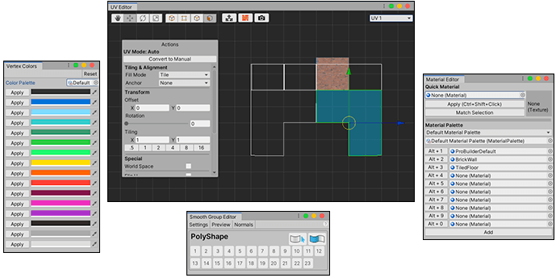

#  Interacting with ProBuilder

ProBuilder provides several ways to interact with its tools and actions:

**(A)** The [Scene Information](#sceneinfo)

**(B)** The [ProBuilder menu](menu.md)

**(C)** [ProBuilder shortcuts](hotkeys.md)

**(D)** [Editor windows](#pb_editors)

**(E)** The [ProBuilder Preferences](preferences.md) window

**(F)** [Transform tools](#pb_transform) for ProBuilder

**(G)** [ProBuilder component](#pb_comp) windows

**(H)** The [ProBuilder toolbar](toolbar.md) and the [Edit mode toolbar](edit-mode-toolbar.md)

**(I)** [Options for ProBuilder actions](toolbar.md#pb_options)

**(J)** ProBuilder's custom [Tool](ref_tools.md) panel

## Scene Information

**Scene Information** displays information about the Meshes in the scene, and which elements are selected.

To toggle this on or off, use the **Show Scene Info** setting in the [Preferences](preferences.md#info_overlay).

## Editor windows

Editor windows provide [features](tool-panels.md) with extended functionality. For example, the UV Editor window (in the example image above) allows you to perform advanced texture manipulations, including texture mapping, UV unwrapping, and tiling.

To access these windows, use the [Probuilder menu](menu.md), [shortcuts](hotkeys.md), or the tool section of the [ProBuilder toolbar](toolbar.md).

## Component sections in the Inspector

Most of these component sections appear in the Inspector when you create a Mesh with one of the creation tools:

* [Shape](shape-tool.md)
* [Poly Shape](polyshape.md)
* [Bezier shape](bezier.md) (Experimental)

When you first activate a creation tool, Unity adds these components to the new GameObject. They expose specific properties defined in the corresponding scripts which help define the topology. After you create the new Mesh, you can re-activate the tool for the same Mesh and change these properties to modify the Mesh's shape.

> **Note**: When you re-activate one of these tools, you lose any modifications you made to the Mesh through an action or through the [Cut](cut-tool.md) tool. For example, imagine you create a new Poly Shape with five points, and then extrude one of the faces. Next, you decide to remove one of the points, so you enter Poly Shape editing mode again. The extrusion disappears as soon as you re-enter Poly Shape editing mode.

In addition to these creation tool components, every ProBuilder object has a [ProBuilder MeshFilter](ProBuilderMesh.md) component. It lets you customize lightmap UV parameters for each object. When you [ProBuilderize](Object_ProBuilderize.md) a Mesh that was either exported into Unity or created as a regular primitive Unity Mesh, Unity adds this component to the Mesh.

## Transform tools in ProBuilder

Most of the time, you interact with ProBuilder with translation, rotation, and scaling tools in much the same way that you interact with Unity. However, ProBuilder uses a combination of [Edit modes](modes.md) and special [key combinations](hotkeys.md) to interact at a much deeper level with your Meshes.

For example, you can use the Shift key with the scaling and translation tools in [Face mode](modes.md) to create [insets](Face_Inset.md) and [extrusions](Face_Extrude.md). This allows you to build complex Meshes easily.

For an overview of working with ProBuilder, see [Creating Meshes](workflow-create.md), [Editing Meshes](workflow-edit.md), and [Materials, Shaders, Textures, and UVs](workflow-texture-mapping.md).
