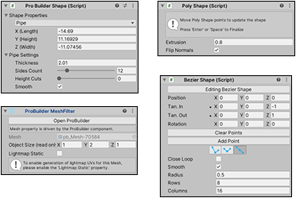

#  Interacting with ProBuilder

ProBuilder provides several ways to interact with the tools:

 The [Scene Information](#sceneinfo)

 The [ProBuilder menu](menu.md) 

 [ProBuilder hotkeys](hotkeys.md)

 [Editor windows](#pb_editors)

 The [ProBuilder Preferences](preferences.md) window 

 [Transform tools](#pb_transform) for ProBuilder

 The [ProBuilder toolbar](toolbar.md) and the [Edit mode toolbar](edit-mode-toolbar.md) 

 [ProBuilder tool options](toolbar.md#pb_options) 

 [ProBuilder component](#pb_comp) windows

## Scene Information

**Scene Information** displays information about the Meshes in the Scene, and which elements are selected. 

To toggle this on or off, use the **Show Scene Info** setting in the [Preferences](preferences.md#info_overlay).

## Editor windows

Editor windows provide [tools or features](tool-panels.md) with extended functionality. For example, the UV Editor window (in the example image above) allows you to perform advanced texture manipulations, including texture mapping, UV unwrapping, and tiling. 

To access these windows, use the [Probuilder menu](menu.md), [hotkeys](hotkeys.md), or the tool panel section of the [ProBuilder toolbar](toolbar.md).

## Component windows

There are two component windows in ProBuilder that help define topology: 

* [Poly Shape](polyshape.md) 
* [Bezier shape](bezier.md) (Experimental)

These components provide the ability to re-edit the base shape as many times as necessary. However, using them discards any standard ProBuilder Mesh edits made previously. 

For example, imagine you create a new Poly Shape with five points, and then extrude one of the faces. Next, you decide to remove one of the points, so you enter Poly Shape editing mode again. The extrusion disappears as soon as you re-enter Poly Shape editing mode.

The [Pro Builder Mesh](ProBuilderMesh.md) component window appears on every ProBuilder object. It allows you to customize lightmap UV parameters for each object.

## Transform tools in ProBuilder

Most of the time, you interact with ProBuilder with translation, rotation, and scaling tools in much the same way that you interact with Unity. However, ProBuilder uses a combination of [Edit modes](modes.md) and special [key combinations](hotkeys.md) to interact at a much deeper level with your Meshes. 

For example, you can use the Shift key with the scaling and translation tools in [Face mode](modes.md) to create [insets](Face_Inset.md) and [extrusions](Face_Extrude.md). This allows you to build complex Meshes easily. 

For an overview of working with ProBuilder, see [Creating Meshes](workflow-create.md), [Editing Meshes](workflow-edit.md), and [Materials, Shaders, Textures, and UVs](workflow-texture-mapping.md).

