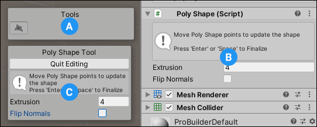
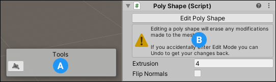

#  Poly Shape tool

Use the Poly Shape tool to [create a custom polygonal shape](workflow-create-polyshape.md). When you activate the Poly Shape tool to create a new shape, the **Poly Shape Tool** panel appears in the bottom of the Scene view. After you initially [create a Poly Shape](workflow-create-polyshape.md), the Poly Shape is still active, but in editing mode:

 

**(A)** You can toggle the  Edit Poly Shape button on the **Tools** panel to toggle the Poly Shape editing mode on and off.

**(B)** You can modify the **Extrusion** (height of the Mesh) and the **Flip Normals** properties on the **Poly Shape** component.

**(C)** The **Poly Shape Tool** panel lets you the modify the **Extrusion** and the **Flip Normals** properties too. The **Quit Editing** button exits the Poly Shape editing mode.

While the Poly Shape editing mode is active, you can also modify the base shape by adding, deleting, or moving any of the points that define the Poly Shape.

>  **Note**: If you are in editing mode immediately after creating a new Poly Shape Mesh, you can also click **New Poly Shape** () on the ProBuilder toolbar to exit the Poly Shape tool.

## Editing a Poly Shape

If you exited the Poly Shape tool, you can re-activate it to modify the **Extrusion** and the **Flip Normals** properties. To re-activate the Poly Shape editing mode: 

1. Select the Poly Shape you want to modify. The **Tools** panel displays the  Edit Poly Shape button and the **Poly Shape** component appears in the Inspector with the **Edit Poly Shape** button.

	

2. Click either button to activate the Poly Shape editing mode.

> **Note:** You can modify Mesh elements on the Poly Shape Mesh with the standard ProBuilder editing tools. However, each time you re-enter Poly Shape editing mode, you lose any element changes.

To modify the shape in Poly Shape editing mode, perform the following tasks in the Scene view:

- Click and drag existing control points to move them around.
- Click existing control points to select them, then use **Backspace** (Windows) or **Delete** (macOS) to remove the points from the shape.
- Click along the perimeter line to add new control points.
- Click and drag the handle in the center of the Mesh to set the height.

You can also use the controls in the **Poly Shape** component in the Inspector to:

- Enter a value to use for the height of the Mesh in the **Extrusion** property.
- Enable or disable the **Flip Normals** option to toggle whether the Camera displays the interior or exterior of the Mesh.

