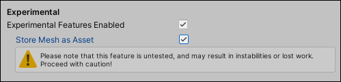
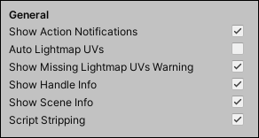
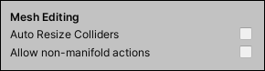

# ProBuilder Preferences window

To define how you interact with ProBuilder, you can customize the user interface and how the tools work.

ProBuilder provides the following preference sections, which you can change to suit your needs:

- [Dimensions Overlay](#dimover)
- [Experimental](#experimental) 
- [General](#general)
- [Graphics](#graphics)
- [Mesh Editing](#prefs_editing)
- [Mesh Settings](#settings)
- [Snap Settings](#snapping)
- [Toolbar](#toolbar)
- [UV Editor](#uvs)

## Dimensions Overlay

Use this setting to customize the [Dimensions Overlay](menu-dimover.md).

By default, the overlay shows the dimensions of the selected Mesh elements only, but you can use the **Bounds Display** property to change this to show the dimensions of the select GameObjects, regardless of what elements (vertices, edges, or faces) are selected.

| **Property:** | **Description:**                                             |
| :------------ | :----------------------------------------------------------- |
| __Object__    | Select this option to use the selected object(s) to calculate the dimensions of the world space bounds for the information that appears on the overlay. |
| __Element__   | Select this option to use the selected element(s) to calculate the dimensions of the world space bounds for the information that appears on the overlay. This is the default. |

## Experimental

Use these settings to enable and disable ProBuilder experimental features.

> **Warning:** Experimental features are untested and might break your Project.

| **Property:**                     | **Description:**                                             |
| :-------------------------------- | :----------------------------------------------------------- |
| __Experimental Features Enabled__ | Enable this option to access the [New Bezier Shape](bezier.md) experimental feature in the ProBuilder toolbar, and the __Store Mesh as Asset__ option.   **Note:** This setting has no affect on access to the [Boolean (CSG) Tool](boolean.md), which is always available from the [Experimental menu](menu-experimental.md). |
| __Meshes Are Assets__             | Enable this option to store Mesh information in the Project instead of in each separate Scene level. |

> **Note**: When you toggle Experimental Features on or off, Unity has to recompile scripts because the changes add or remove functionality in Unity. This means that there is a delay before this option appears to change.

## General

Use these properties to set some basic options for ProBuilder.

|**Property:** |**Description:** |
|:---|:---|
|__Show Action Notifications__ |Enable this option if you want ProBuilder to notify you when performing actions. |
|__Auto Lightmap UVs__ |Enable this option to generate the UV2 channel after every geometry edit. This means you don't have to manually generate them every time the Mesh changes.  UV2 channel generation for Meshes is necessary for lighting, but can be time-consuming. If you are editing objects with large numbers of vertices, disable this to save resources. |
|__Show Missing Lightmap UVs Warning__ |Enable this option to show a warning in the console if ProBuilder shapes are missing a valid UV2 channel when Unity performs a lightmap bake. |
|__Show Handle Info__ |Enable this option to display the information for moving, rotating, and scaling deltas in the bottom right of the Scene view.   **Note**: If you have the [Component Editor **Tools** panel](https://docs.unity3d.com/Manual/UsingCustomEditorTools.html#ToolModesAccessSceneViewPanel) open in the Scene view, it covers this information. Close the panel to display the information. |
|__Show Scene Info__ |Enable this option to display the Mesh information overlay in the top left of the Scene view. These details include overall face, vertex and triangle counts, and the number of elements currently selected:  |
|__Script Stripping__ |Enable this option to automatically remove the extra data ProBuilder stores in a Scene. This includes all ProBuilder scripts, so if you are using the runtime API you should disable this feature. |

## Graphics

Use these settings to customize the size and color of Mesh elements.

By default, the **Use Unity Colors** option is enabled. However, you can disable this option to set custom colors for a number of elements.

|**Property:** |**Description:** |
|:---|:---|
| __Show Hover Highlight__ | Enable this option to highlight the closest Mesh elements when your cursor moves towards them.   **Tip:** You can also set the color to use for highlighting with the [Preselection](#preselection_color) property. |
| __Selection X-Ray__ | Enable this option to display any selected hidden geometry.  |
|__Use Unity Colors__ |Enable this property to use the [standard Unity Color preferences](https://docs.unity3d.com/Manual/Preferences.html#colors). By default, this property is enabled.  When you disable this option, a number of properties appear below. These allow you to specify your own colors to use instead of the Unity colors. For example, you can specify different colors for selected and unselected faces, edges, and vertices. |
|__Dither Face Overlay__ |Enable this option to use dithering (dotted overlay) when you hover over or select items. If you disable this option, the overlay appears solid instead.  This property is only available when __Use Unity Colors__ is disabled. |
|__Wireframe__ |Pick the color ProBuilder uses to display the Mesh's wireframe.  This property is only available when __Use Unity Colors__ is disabled. |
|__Preselection__ |Pick the color ProBuilder uses to highlight the closest Mesh element. The [Show Preselection Highlight](#preselection) property must be enabled in order to display highlights.  This property is only available when __Use Unity Colors__ is disabled. |
|__Selected Face Color__ |Pick the color ProBuilder uses to display the selected face(s) in a ProBuilder Mesh.  This property is only available when __Use Unity Colors__ is disabled. |
|__Unselected Edge Color__ |Pick the color ProBuilder uses to display the unselected edges in a ProBuilder Mesh.  This property is only available when __Use Unity Colors__ is disabled. |
|__Selected Edge Color__ |Pick the color ProBuilder uses to display the selected edge(s) in a ProBuilder Mesh.  This property is only available when __Use Unity Colors__ is disabled. |
|__Unselected Vertex Color__ |Pick the color ProBuilder uses to display the unselected vertices in a ProBuilder Mesh.  This property is only available when __Use Unity Colors__ is disabled. |
|__Selected Vertex Color__ |Pick the color ProBuilder uses to display the selected vertex (or vertices) in a ProBuilder Mesh.  This property is only available when __Use Unity Colors__ is disabled. |
|__Vertex Size__ |Set the size to render the vertex points on ProBuilder Meshes in the Scene view. |
|__Line Size__ |Set the size to render the edges on ProBuilder Meshes in the Scene view.   **Note:** On macOS, this property is only available if you use [OpenGL](https://www.opengl.org/) instead of Metal.|
|__Wireframe Size__ |Set the size to render the ProBuilder Mesh wireframe in the Scene view.   **Note:** On macOS, this property is only available if you use [OpenGL](https://www.opengl.org/) instead of Metal. |

## Mesh Editing

Use these settings to customize interacting with Meshes.

| **Property:**                                     | **Description:**                                           |
| :-------------------------------------------------- | :----------------------------------------------------------- |
| __Auto Resize Colliders__                           | Enable this option to automatically resize colliders according to Mesh bounds as you edit. |
| __Allow non-manifold actions__ | Enable this option if you want to edit your Meshes with advanced techniques, such as [bridging closed edges](Edge_Bridge.md). Note that these complex actions can break your project unless you are familiar with their concepts and how to apply them.  By default, this option is disabled. |

## Mesh Settings

Use these settings to establish default behavior for some ProBuilder options.

<table>
<thead>
<tr>
<th colspan="2"><strong>Property:</strong></th>
<th><strong>Description:</strong></th>
</tr>
</thead>
<tbody>
<tr>
<td colspan="2"><strong>Material</strong></td>
<td>Set a reference to the default Material you want to use for ProBuilder Meshes. By default, ProBuilder uses the ProBuilderDefault Material when creating new Meshes.</td>
</tr>
<tr>
<td colspan="2"></a><strong>Static Editor Flags</strong></td>
<td>Choose one of the <a href="https://docs.unity3d.com/Manual/StaticObjects.html">Unity Static Settings</a> as the default for new ProBuilder Meshes. The default value is <strong>Nothing</strong>.</td>
</tr>
<tr>
<td colspan="2"></a><strong>Mesh Collider is Convex</strong></td>
<td>Enable this option to set the default convex collider state for new ProBuilder objects.</td>
</tr>
<tr>
<td colspan="2"></a><strong>Pivot Location</strong></td>
<td>Choose the default pivot location for new ProBuilder objects.</td>
</tr>
<tr>
<td></td>
<td><strong>First Corner</strong></td>
<td>Use the "first corner" as the pivot point for the newly created Mesh. The first corner refers to where you first clicked in the Scene view to create it.</td>
</tr>
<tr>
<td></td>
<td><strong>Center</strong></td>
<td>Use the center of the newly instantiated object as the pivot point.</td>
</tr>
<tr>
<td colspan="2"></a><strong>Snap New Shape To Grid</strong></td>
<td>Enable this option to snap a newly instantiated object to the nearest grid point (as determined by <strong>ProGrids</strong>).</td>
</tr>
<tr>
<td colspan="2"></a><strong>Shadow Casting Mode</strong></td>
<td>Choose how new ProBuilder Meshes cast shadows. The default value is <strong>Two Sided</strong>. See the <strong>Cast Shadows</strong> property on the <a href="https://docs.unity3d.com/Manual/class-MeshRenderer.html">Mesh Renderer</a> component for more information on this setting.</td>
</tr>
<tr>
<td colspan="2"></a><strong>Collider Type</strong></td>
<td>Set the default type of <a href="https://docs.unity3d.com/Manual/CollidersOverview.html">collision primitive</a> to use for new ProBuilder objects. The default is <strong>Mesh Collider</strong>.</td>
</tr>
<tr>
<td></td>
<td><strong>None</strong></td>
<td>Do not use a collider.</td>
</tr>
<tr>
<td></td>
<td><strong>Box Collider</strong></td>
<td>Use a <a href="https://docs.unity3d.com/Manual/class-BoxCollider.html">basic cube</a> for the collider.</td>
</tr>
<tr>
<td></td>
<td><strong>Mesh Collider</strong></td>
<td>Use a <a href="https://docs.unity3d.com/Manual/class-MeshCollider.html">custom shape collider</a> to match the newly created Mesh. This is the default.</td>
</tr>
<tr>
<td colspan="2"></a><strong>Lightmap UVs Settings</strong></td>
<td>Set defaults for the standard <a href="https://docs.unity3d.com/Manual/LightingGiUvs-GeneratingLightmappingUVs.html">Lightmap UVs parameters</a>. To return to the default settings, click the <strong>Reset</strong> button.</td>
</tr>
</tbody>
</table>

## Snap Settings

Use these properties to customize how snapping behaves with ProBuilder.

<table>
<thead>
<tr>
<th colspan="2"><strong>Property:</strong></th>
<th><strong>Description:</strong></th>
</tr>
</thead>
<tbody>
<tr>
<td colspan="2"><strong>Snap As Group</strong></td>
<td>Enable this option if you want each selected item to keep the same relative position to each other while snapping. This is the default. Disable this option to snap each selected item to the grid independently.</td>
</tr>
<tr>
<td colspan="2"><strong>Snap Axis</strong></td>
<td>Choose how vertices snap to the grid while moving.</td>
</tr>
<tr>
<td></td>
<td><strong>Active Axis</strong></td>
<td>Vertices snap only along the currently active axis. This is the default.</td>
</tr>
<tr>
<td></td>
<td><strong>All Axes</strong></td>
<td>Vertices snap to all axes simultaneously.</td>
</tr>
</tbody>
</table>

## Toolbar

Use these properties to set default behavior for the [ProBuilder toolbar](toolbar.md).

| **Property:** | **Description:** |
| :--- | :--- |
| __Shift Key Tooltips__ | Enable this option to only show tooltips when the mouse cursor is hovering over a button and you are holding down **Shift**. By default, tooltips appear when the mouse cursor hovers over a button for more than a second. |
| __Icon GUI__ | Enable this option to use toolbar buttons that [display icons only](toolbar.md#buttonmode).  Disable this option to use toolbar buttons that [display text only](toolbar.md#buttonmode). **Note:** You can also [use the context menu](customizing.md#buttons) to switch between icons and text. |
| __Toolbar Location__ | Choose the location where you want the [Edit Mode toolbar](edit-mode-toolbar.md) to appear in the Scene view. Possible locations are:  - **Upper Center** - **Upper Left** - **Upper Right** - **Bottom Center** - **Bottom Left** - **Bottom Right** |

## UV Editor

Use this setting to customize the [UV Editor window](uv-editor.md).

| **Property:** | **Description:**                                           |
| :-------------- | :----------------------------------------------------------- |
| __Grid Size__   | Size of the grid in the UV Editor, for visual and functional purposes. |
