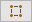

# Tool reference

This table lists all the icons and tool names available in ProBuilder, and indicates which [Edit modes](modes.md) supports it:

| **Icon** | **Text** |  |  |  |  |
| ---- | ---- | ---- | ---- | ---- | ---- |
|  |[Bevel](Edge_Bevel.md)  (Edges) | | | x | |
|  |[Bevel](Face_Bevel.md) (Faces) | | | | x |
|  |[Bridge Edges](Edge_Bridge.md) | | | x | |
|  |[Center Pivot](CenterPivot.md) | x | | | |
|  |[Collapse Vertices](Vert_Collapse.md) | | x | | |
|  |[Conform Normals](Face_ConformNormals.md) (Faces) | | | | x |
|  |[Conform Normals](Object_ConformNormals.md) (Objects) | x | | | |
|  |[Connect Edges](Edge_Connect.md) | | | x | |
|  |[Connect Vertices](Vert_Connect.md) | | x | | |
|  |[Delete Faces](Face_Delete.md) | | | | x |
|  |[Detach Faces](Face_Detach.md) | | | | x |
|  |[Export](Object_Export.md) | x | | | |
|  |[Extrude Edges](Edge_Extrude.md) | | | x | |
|  |[Extrude Faces](Face_Extrude.md) | | | | x |
|  |[Fill Hole](Edge_FillHole.md) (Edges) | | | x | |
|  |[Fill Hole](Vert_FillHole.md) (Vertices) | | x | | |
|  |[Flip Face Edge](Face_FlipTri.md)  | | | | x |
|  |[Flip Face Normals](Face_FlipNormals.md) | | | | x |
|  |[Flip Normals](Object_FlipNormals.md) | x | | | |
|  |[Freeze Transform](Freeze_Transform.md) | x | | | |
|  |**Handle** (see [Orientation](HandleAlign.md)) | x | x | x | x |
|  |[Lightmap UVs](Object_LightmapUVs.md) | x | | | |
|  |[Grow Selection](Selection_Grow.md) | | x | x | x |
|  |[Insert Edge Loop](Edge_InsertLoop.md)  | | | | |
|   |[Inset](Face_Inset.md) | | | | x |
|  |[Invert Selection](Selection_Invert.md) | | x | x | x |
|  |[Merge Faces](Face_Merge.md) | | | | x |
|  |[Merge Objects](Object_Merge.md) | x | | | |
|  |[Mirror Objects](Object_Mirror.md) | x | | | |
|  |[Orientation](HandleAlign.md) | x | x | x | x |
|  |[ProBuilderize](Object_ProBuilderize.md) | x | | | |
|  |[Rect](Selection_Rect_Intersect.md) | | | x | x |
|  |[Select by Colors](Selection_SelectByVertexColor.md) | | x | x | x |
|  |[Select by Material](Selection_SelectByMaterial.md) | | | | x |
|  |[Select Edge Loop](Selection_Loop_Edge.md) | | | x | |
|  |[Select Edge Ring](Selection_Ring_Edge.md) | | | x | |
|  |[Select Face Loop](Selection_Loop_Face.md) | | | | x |
|  |[Select Face Ring](Selection_Ring_Face.md) | | | | x |
|  |[Select Hidden](Selection_SelectHidden.md) | x | x | x | x |
|  |[Select Holes](Selection_SelectHole.md) | | x | x | |
|   |[Set Collider](Entity_Trigger#Collider.md) | x | | | |
|  |[Set Pivot](Edge_SetPivot.md) (Edges) | | | x | |
|  |[Set Pivot](Face_SetPivot.md) (Faces) | | | | x |
|  |[Set Pivot](Vert_SetPivot.md) (Vertices) | | x | | |
|   |[Set Trigger](Entity_Trigger.md) | x | | | |
|  |[Shift](Selection_Shift.md) | | x | x | x |
|  |[Shrink Selection](Selection_Shrink.md) | | x | x | x |
|  |[Split Vertices](Vert_Split.md) | | x | | |
|  |[Subdivide Edges](Edge_Subdivide.md) | | | x | |
|  |[Subdivide Faces](Face_Subdivide.md) | | | | x |
|  |[Subdivide Object](Object_Subdivide.md) | x | | | |
|  |[Triangulate Faces](Face_Triangulate.md) | | | | x |
|  |[Triangulate](Object_Triangulate.md) (Object) | x | | | |
|  |**Turn Edges** (see [Flip Face Edge](Face_FlipTri.md)) |  | | | x |
|  |[Weld Vertices](Vert_Weld.md) | | x | | |

