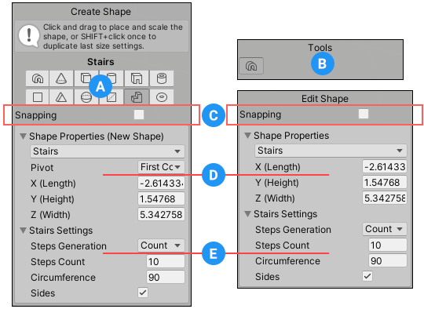

#  Shape tool

Use the Shape tool to [create new ProBuilder Meshes](workflow-create-predefined.md) based on common primitive shapes, such as cylinders, arches, and stairs. When you activate the Shape tool to create a new shape, the **Create Shape** panel appears in the bottom of the Scene view. You can either draw in the Scene view or set the properties directly in the **Create Shape** panel to define a bounding box that will hold the new shape. You can also customize any shape-specific settings, and then either exit the tool or create another new shape. 

> **Tip**: After you create a new shape and exit the tool, you can redefine the bounding box, switch primitive shapes, and change the shape-specific settings when you select the Edit Shape icon  from the **Tools** panel. If you made any modifications to the Mesh topology (such as [splitting vertices](Vert_Split.md), [connecting edges](Edge_Connect.md), or [extruding faces](Face_Extrude.md)), you must reset the shape to remove all manual changes before you can proceed.

**(A)** Shape icons let you choose the shape's primitive when you are drawing a new shape.

**(B)** The **Tools** panel displays the Edit Shape icon  when you have a Shape Mesh selected. You can toggle this icon to turn the editing mode on and off.

**(C)** The **Snapping** option only appears when you use ProBuilder inside a version of Unity prior to 2021.1. It enables auto-snapping for the Shape tool. For more information, see [Snapping](#Snapping).

**(D)** The **Shape Properties** section lets you switch to a new shape primitive and define the size of the bounding box. When you are drawing a new shape, the **Pivot** property lets you specify whether to place the pivot at the corner or in the middle of the bounding box. For details, see [Choosing the shape and size](#ShapeProperties).

**(E)** The **&lt;Shape&gt; settings** section lets you customize the new shape with properties that are specific to each shape. For example, you can change the number of sides (faces) for both cylinders and cones, but for cylinders you can also set the smoothing group and set segment heights for the sides. For details, see [Customizing specific shapes](#ShapeSpecificSettings).

## Choosing the shape and size  

The properties under the **Shape Properties** section let you choose a shape primitive and define the parameters of the bounding box in which ProBuilder will draw the shape.

| **Property:**        | **Description:** |
| -------------------- | ---------------- |
| Shape drop-down menu |       Select the shape primitive you want to create. For details, see [Customizing specific shapes](#ShapeSpecificSettings). |
| **Pivot** | Select whether you want ProBuilder to create the Mesh's pivot handle in the **First Corner** of the shape's bounding box or in its **Center**. The "first corner" is where you first clicked in the Scene view to define the bounding box.  **Note**: This property is only available when you are creating the shape. |
| **X (Length)**  **Y (Height)**  **Z (Width)** | You can define the bounding box's size with these properties on every shape. When you select a different shape primitive or change any of these properties, ProBuilder automatically transforms the shape to fit the dimensions of the bounding box. |

## Customizing specific shapes

The following sections contain information about each shape primitive, including a list of any shape-specific properties available:

|||
|--|--|
|  [Arch](Arch.md) shape primitive  [Cone](Cone.md) shape primitive  [Cube](Cube.md) shape primitive  [Cylinder](Cylinder.md) shape primitive  [Door](Door.md) shape primitive  [Pipe](Pipe.md) shape primitive |  [Plane](Plane.md) shape primitive  [Prism](Prism.md) shape primitive  [Sphere](Sphere.md) shape primitive  [Sprite](Sprite.md) shape primitive  [Stairs](Stair.md) shape primitive  [Torus](Torus.md) shape primitive |

ProBuilder Meshes are similar to other GameObjects in Unity in terms of how they interact with other GameObjects and respond to Physics in the Scene. However, you can use [ProBuilder editing features](workflow-edit.md) to customize and deform the Mesh topology after you create them. 

## Snapping

To set a more accurate size, snap the bounding box to [Unity's grid](https://docs.unity3d.com/Manual/GridSnapping.html) while you draw or move the preview shape in the Scene view. To do this, enable auto-snapping with the Shape tool by using one of the following methods that matches the version of the Editor you are using:

* **Version 2021.1 and later**: [Activate Unity auto-snapping](https://docs.unity3d.com/Manual/GridSnapping.html#grid-snap) in the Editor. The **Snapping** option is not available because ProBuilder uses the Editor's auto-snapping setting.
* **Versions 2019.4 through 2020.3**: Enable the **Snapping** option. ProBuilder ignores Unity's auto-snapping setting in these versions of the Unity Editor.

> **Note**: Auto-snapping is only available when your [gizmo handle](https://docs.unity3d.com/Manual/PositioningGameObjects.html#GizmoHandlePositions) is set to **Global** in any version of Unity.

Regardless of whether auto-snapping is enabled, you can hold the **Ctrl/Cmd** key while drawing or positioning the new shape to move by increments. To set the size of these increments, use the **Increment Snap** property on the [Grid and Snap](https://docs.unity3d.com/Manual/GridSnapping.html#grid-and-snap) window.

