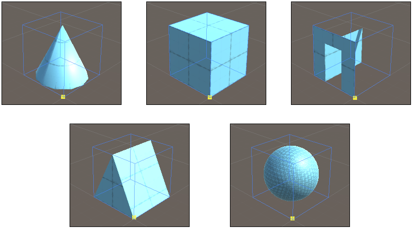

# New Shape and Edit Shape tools

To add built-in ProBuilder shapes, use the **New Shape** tool.

Although the shape is predefined, you set its dimensions yourself by defining the size of the shape's bounding box. The size of the box is based on x, y, and z values, which start on the "first corner" of the box: the first click you make in the **Scene** view when you draw. 

If you change the shape primitive of a shape while working on it, ProBuilder instantly adjusts the dimensions of the shape to fit within the bounding box.

## Create a shape

To create a new shape:

1. Activate the New Shape tool in one of the following ways:
    * In the **Tools** overlay, select **New Shape**. A short click creates the selected shape; a long click opens a selection menu to choose a different shape.
    * In the main menu, go to **Tools** > **ProBuilder** > **Editors** > **New Shape** and select a shape.
1. Draw points in the **Scene** view to create the 2D outline of the shape. To help you draw in an exact location, use [**Snap to Grid**](snap-to-grid.md).
1. When you connect the last point to the first point, you can extrude the shape to create a 3D object.
    > **Tip:** You can enter the dimensions of the shape in the **Shape Settings** window before drawing it. When you draw, the shape conforms to the dimensions you set.

## Edit a shape

To edit an existing shape:

1. Select the shape in the **Scene** view.
1. In the **Tools** overlay, set the active context to ProBuilder. 
1. In the **Tools** overlay, click **Edit ProBuilder Shape** to:
    * Open the **Shape Settings** window. Refer to [Shape settings](#shape-settings)
    * Activate an element selection (face, edge, or vertex) mode and redesign the shape. 

## Shape settings

Each shape has its own settings. 

To access the settings for a shape, select the shape in the **Scene** view and click **Edit Shape** in the **Tools** overlay. The **Shape Settings** window open. 

**Tip:** These settings are also available in the **Inspector** window.

For more information about each shape, refer to:

* [Cube](Cube)
* [Sphere](Sphere)
* [Plane](Plane)
* [Cylinder](Cylinder)
* [Cone](Cone)
* [Prism](Prism)
* [Stairs](Stair)
* [Torus](Torus)
* [Pipe](Pipe)
* [Arch](Arch)
* [Door](Door)
* [Sprite](Sprite)
