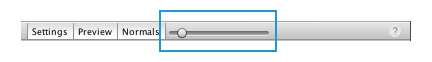
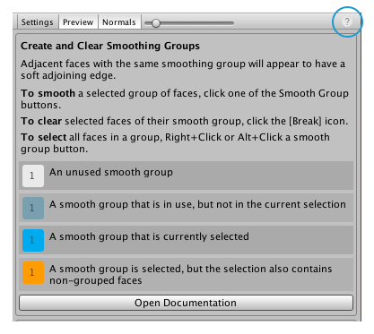
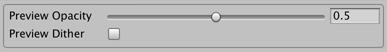
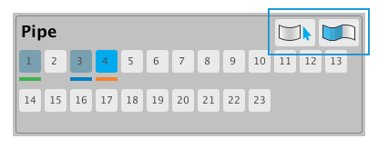

#  Smooth Group Editor window

The **Smooth Group Editor** window allows you to [add and remove smoothing groups](workflow-edit-smoothing.md) across the faces of a ProBuilder Mesh.

**(A)** The [toggle buttons](#toggle) control the visibility of some areas of the window.

**(B)** The [Normals control](#normals) is a visual aid that allows you to change the length of the normals displayed on the Mesh in the Scene view.

**(C)** The help button opens up a [quick reference panel](#quickref) for using this window.

**(D)** The [overlay controls panel](#overlay) allows you to customize how ProBuilder previews the smoothing group changes on the Mesh in the Scene view.

**(E)** The [main button panel](#main-panel) allows you to define up to 23 sets of smoothing groups.

> **Tip:** You can also access this tool from the ProBuilder menu (**Tools** > **ProBuilder** > **Editors** > **Open Smoothing Editor**).

## Toggle Panel buttons

The cluster of buttons in the top left corner of the window hide or display the extra panels:

* The **Settings** button shows or hides the [overlay controls](#overlay) above the main button panel.
* The **Preview** button shows or hides the color cues for each smoothing group. The color for each defined group appears under the button in the [main button panel](#main-panel), and all the faces in the smoothing group display that color on the Mesh in the Scene view.
* The **Normals** button shows or hides the [Normals control](#normals).

## Normals control

You can use the Normals slider control to change the length of the normals ProBuilder displays on the Mesh. Viewing the normals allows you to see which vertices are split, therefore affecting the smoothing.

Move the slider position towards the left to shorten the length of the normals, or move them to the right to lengthen them. When the slider is all the way to the left, the normals are no longer visible.

## Quick reference panel

The following hints about using the smoothing panels appear when you click the help button in the top right corner of the **Smooth Group Editor** window:

To access the online documentation for Smoothing Groups, at the bottom of the panel, click the **Open Documentation** button. 

## Overlay controls

The overlay controls panel allows you to customize how ProBuilder previews the smoothing group changes on the Mesh in the Scene view.

| **Property:**     | **Description:**                                           |
| ------------------- | ------------------------------------------------------------ |
| **Preview Opacity** | Increase this value to show more of the color of the applied smoothing group and less of the Mesh's Material. The range of values is **0.001** (smoothing group colors are invisible) to **1** (only smoothing colors are visible). |
| **Preview Dither**  | Enable this option to see how ProBuilder applies the smoothing to the Mesh with the dither overlay. |

## Main button panel

The main button panel allows you to define up to 23 sets of smoothing groups.

### Buttons

These buttons in the top right corner help you manage smoothing groups:

* Click the  __Select Smoothing Group__ button to extend the face selection to all faces in the currently selected smoothing group. For best results, click a single face in the group to start and then click this button. ProBuilder doesn't shrink the current selection, so start with as small a selection as possible.
* Click the  __Clear Smoothing Group__ button to remove all faces from the currently selected smoothing group.

### Preview colors

This panel is always visible, but the color under each button only appears in [Preview mode](#toggle).

Whether or not you are in Preview mode, the button background changes color according to what faces and smoothing group you've selected:

| **Button color:**                                          | **Description:**                                           |
| ------------------------------------------------------------ | ------------------------------------------------------------ |
|  | No faces are in the selected Smoothing Group yet.                |
|  | None of the selected faces are in the selected Smoothing Group. |
|  | All of the faces in the currently selected Smoothing Group are currently selected. |
|  | The current selection includes faces that are in the currently selected Smoothing Group, but it also includes faces that are not in any Smoothing Group. |
