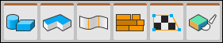

# Tool panels

This portion of the ProBuilder toolbar provides access to most of the ProBuilder windows, tools, and actions.

##  New Shape

Use the **New Shape** tool to create new ProBuilder Mesh shapes such as cylinders, arches, and stairs.

For more information, see [Shape tool](shape-tool.md).

##  New Bezier Shape

Use the **Bezier Shape** tool to define a bezier curve around which ProBuilder extrudes a Mesh. 

> **Warning:** Bezier shapes are experimental, meaning that they are still under development, and might reduce ProBuilder's stability. Please use with caution. 
>
> Because this tool is experimental, the button only appears when you [enable experimental features](preferences.md#experimental) for ProBuilder. 

For more information about the tool, see [Bezier Shape tool](bezier.md).

##  New Poly Shape

Use the **Poly Shape** tool to create a custom 2-dimensional shape and then extrude that shape to create a 3-dimensional Mesh.

For more information, see [Poly Shape tool](polyshape.md).

##  Smoothing

Use the **Smooth Group Editor** window to create a smooth and rounded look.

For more information, see the [Smooth Group Editor](smoothing-groups.md) window reference.

##  Material Editor

Use the **Material Editor** window to apply Materials to objects or faces.

For more information, see the [Material Editor](material-tools.md) window reference.

##  UV Editor

Use the **UV Editor** window to apply textures to objects or faces. You can also use it to automatically or manually wrap and unwrap textures.

For more information, see the [UV Editor](uv-editor.md) window reference.

##  Vertex Colors

Use the **Vertex Colors** window to apply or paint vertex colors onto Meshes.

For more information, see the [Vertex Colors](material-tools.md) window reference.