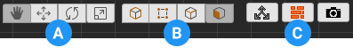

---

<!-- # Video: UV Editor Toolbar

 -->

## Select, Move, Rotate, Scale

<!--div class="video-link-missing">
Section Video: <a href="@todo">UV Editor Toolbar: Manipulators</a>
</div-->

This first group of buttons contains shortcuts to the standard Unity manipulation modes. Clicking these will have the exact same effect as clicking on the main Unity toolbar buttons.

## Vertex, Edge Face

<!--div class="video-link-missing">
Section Video: <a href="@todo">UV Editor Toolbar: Element Selection</a>
</div-->

The second button group contains shortcuts to ProBuilder's [Element Editing Modes](fundamentals#modes). When using [Manual UV Editing](manual-uvs-actions), this allows you to select and manipulate UVs by Vertex, Edge, or Face.  

> **Note:**  When using [Auto UVs](auto-uvs-actions) you may only edit UVs by face. Editing an Edge or Vertex will convert the selected UVs to [Manual UVs](manual-uvs-actions).

##  In-Scene Controls

<!--div class="video-link-missing">
Section Video: <a href="@todo">UV Editor Toolbar: In-Scene Controls</a>
</div-->

When **On**, you can use Unity's standard Move, Rotate, and Scale tools to directly manipulate UVs in the scene, without affecting geometry.

|**Toolbar Icon:** |**Description:** |
|:---|:---|
|  | **On** : Move, Rotate, and Scale tools will affect UVs, geometry will not be affected |
|  |  **Off** : Move, Rotate, and Scale tools will return to normal geometry actions |

Snap to increments by holding `CTRL` . You can customize these increment values via the [ProBuilder Preferences](preferences)

##  Texture Preview

<!--div class="video-link-missing">
Section Video: <a href="@todo">UV Editor Toolbar: Texture Preview</a>
</div-->

When **On**, the selected face's main texture will be displayed in the UV Viewer.

|**Toolbar Icon:** |**Description:** |
|:---|:---|
|  | **On** : Selected element's Texture will be displayed in the UV Viewer |
|  | **Off** : No texture will be displayed in the UV Viewer |

##  Render UV Template

<!--div class="video-link-missing">
Section Video: <a href="@todo">UV Editor Toolbar: Render UV Template</a>
</div-->

Opens the Render UVs tool panel, for rendering UV Templates to be used with texture map painting, atlasing, sprite sheets, etc.

* __Image Size__ : Total size of the rendered template (always square)
* __Hide Grid__ : Should the grid be hidden in the render?
* __Line Color__ : What color should UV lines be rendered as?
* __Transparent Background__ : Should the background be rendered transparent?
* __Background Color__ : If you want a non-transparent background, set the color here
* __Save UV Template__ : Click to render the UV Template - a file dialog will be opened to save the file.

