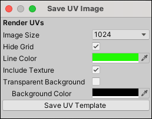

# UV Editor toolbar

**(A)** This first group of buttons contains shortcuts to the standard Unity manipulation tools. These have the same effect as the [main Unity toolbar buttons](https://docs.unity3d.com/Manual/PositioningGameObjects.html).

**(B)** The second button group contains shortcuts to ProBuilder's [Element Edit modes](edit-mode-toolbar.md). When you use [Manual UV Editing](manual-uvs-actions.md), this allows you to select and manipulate UVs by Vertex, Edge, or Face.  

> **Note:** When you use [Auto UVs](auto-uvs-actions.md), you can only edit UVs by face. If you edit an Edge or Vertex, ProBuilder converts the selected UVs to [Manual UVs](manual-uvs-actions.md).

**(C)** The third group of buttons contain buttons to perform the following actions: 

*  __Scope controls__: Control how Unity's standard [transform tools](#Scope) behave.
*  __Texture preview__: Toggle whether the UV Viewer displays the face's [Texture](#Texture).
*  __Save UV image__: Create [UV Templates](#SaveUV) from the current UV mapping.

##  Scope controls

When Scope controls are **on** (), you can use Unity's standard Move, Rotate, and Scale tools to directly manipulate UVs in the scene, without affecting geometry.

When Scope controls are **off** (), the Move, Rotate, and Scale tools return to normal geometry actions.

When you use the Transform tools in the UV Viewer, you can snap to increments with the **Ctrl** (Windows) or **Cmd** (macOS) modifiers. To customize the size of these increment values, set the [UV Snap Increment](preferences.md#uvs) preference.

##  Texture preview

When Texture preview is **on** (), the selected face's Texture appears in the UV Viewer. This preview makes it easier to fit the UV to the Texture.

When Texture preview is **off** (), the Texture does not appear in the UV Viewer.

##  Save UV image

Click the Camera icon () to open the **Save UV Image** window. You can use this window to render a UV Template for texture map painting, atlasing, and sprite sheets.

|**Property:** |**Function:** |
|:---|:---|
|__Image Size__|Choose the total size for the rendered template. ProBuilder always renders the image as a square.|
|__Hide Grid__|Enable this option to prevent the grid from appearing in the rendered image.|
|__Line Color__|Choose the color that you want ProBuilder to use for rendering the UV lines.|
|__Transparent Background__|Enable this option to render a transparent background.|
|__Background Color__|Choose the color that you want ProBuilder to use for the background. This option is only available when the __Transparent Background__ property is disabled.|

When you are satisfied with the options on this window, click the __Save UV Template__ button. A file browser opens so you can choose the filename and location where you want to save the file.
