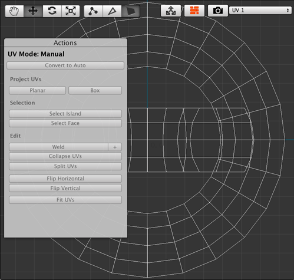
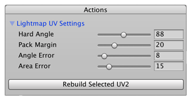

# UV drop-down menu

The UV drop-down menu allows you to switch between [UV1](#uv1) and [UV2](#uv2) modes (ProBuilder does not use UV3 and UV4). __UV1__ provides texture mapping functionality, and __UV2__ provides options for lightmap UV generation.

## UV1

When you select **UV1** from the  UV drop-down menu, the **Actions** panel displays the default UV mapping.

If you select the object before you open the UV Editor window, the Actions panel is empty. To enable editing the UVs, choose one of these element Edit modes:

- Click the [Face Edit Mode button](edit-mode-toolbar.md) and select one or more faces in the UV viewer to edit in either [Auto](auto-uvs-actions.md) or [Manual](manual-uvs-actions.md) UV mode.  
- Click the [Edge Edit Mode button](edit-mode-toolbar.md) and select one or more edges in the UV viewer to begin editing in [Manual](manual-uvs-actions.md) UV mode.
- Click the [Vertex Edit Mode button](edit-mode-toolbar.md) and select one or more vertices in the UV viewer to begin editing in [Manual](manual-uvs-actions.md) UV mode.

To switch between the [Auto](auto-uvs-actions.md) and [Manual](manual-uvs-actions.md) UV modes, click the **Convert to Manual** or **Convert to Auto** button at the top of the **Actions** panel. Both modes provide their own options in the Actions panel.

> **Note:** When using [Auto UVs](auto-uvs-actions.md) you may only edit UVs by face. Editing an edge or vertex automatically converts the selected UVs to [Manual UVs](manual-uvs-actions.md).

## UV2 (read-only)

When you select **UV2 (read-only)** from the UV drop-down menu, the **Actions** panel displays the [Lightmap UV Settings](https://docs.unity3d.com/Manual/LightingGiUvs-GeneratingLightmappingUVs.html) and the **Rebuild Selected UV2** button.

Set up the options for lightmap UV generation for the selected UV2s, then click the **Rebuild Selected UV2** button when you are finished.

> **Note:** This only affects the UV2s that are currently selected. If you want to rebuild the UV2s for the entire scene, use the [Lightmap UV Editor](Object_LightmapUVs.md) window instead.

## UV3 (read-only)

ProBuilder does not currently use this UV mode.

## UV4 (read-only)

ProBuilder does not currently use this UV mode.
