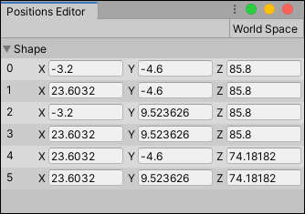
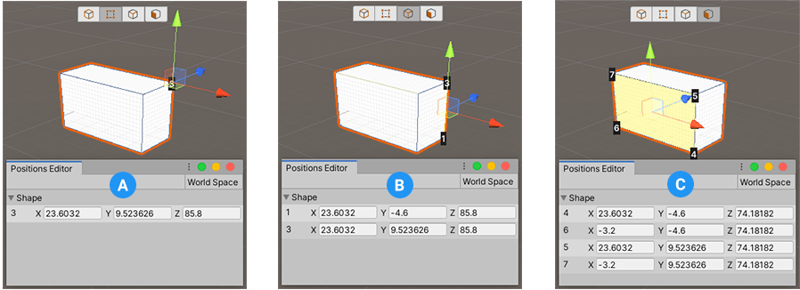

# Positions Editor window

Use the **Positions Editor** window to enter specific translation coordinates to modify vertex positions.

> **Tip:** You can access this tool from the ProBuilder menu (**Tools** > **ProBuilder** > **Editors** > **Open Vertex Position Editor**).

By default, Unity uses absolute coordinates to define positions, but you can click the **World Space** button in the top right corner to use relative coordinates instead (that is, relative to the **Model Space**).

The index of each vertex appears on the left, followed by the **X**, **Y**, and **Z** values that define its position. You can use this window as an alternative to modifying vertex positions with the transform tools.

For example, to create a [Custom Shape](Custom.md) and set the vertex positions with this editor:

1. From the ProBuilder toolbar, **Alt/Opt+click** the **New Shape** () button. 

2. Choose the **Custom** shape from the __Shape Selector__ drop-down menu. 

3. Click the **Build Custom** button and close the **Shape Tool** window.

4. Click the  [Vertex editing mode](modes.md) button on the Edit modes toolbar.

5. Select the vertices that you want to modify.

6. Go to **Tools** > **ProBuilder** > **Editors** and select **Open Vertex Position Editor**.

	You can identify the vertices that appear in the **Positions Editor** by the index number that appears on the shape in the Scene view. 

	

	The vertices appear in the same order as they are defined. They follow a backwards Z pattern for each face.

7. Set new values for the coordinates you want to modify. ProBuilder immediately updates the positions.

