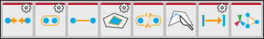

# Vertex actions

This section of the ProBuilder toolbar provides access to ProBuilder editing actions that you can use in the [Vertex edit mode](modes.md).

> **Note:** Some actions also have extra options or custom settings available. These action buttons have a special indicator in the top right corner. The documentation for each action includes information about these options.

##  Collapse Vertices

Use the **Collapse Vertices** action to colapse all selected vertices to a single point, regardless of distance. 

For more information, see the [Collapse Vertices](Vert_Collapse.md) action documentation.

##  Weld Vertices

Use the **Weld Vertices** action to merge selected vertices within a specific distance of one another.

For more information, see the [Weld Vertices](Vert_Weld.md) action documentation.

##  Connect Vertices

Use the **Connect Vertices** action to create a new edge connecting the selected vertices.

For more information, see the [Connect Vertices](Vert_Connect.md) action documentation.

##  Fill Hole

Use the **Fill Hole** action to create a new face filling any holes that touch the selected vertices.

For more information, see the [Fill Hole](Vert_FillHole.md) action documentation.

##  Cut Tool

Use the **Cut** tool to create a new face on an existing Mesh.

For more information, see the [Cut tool](cut-tool.md) documentation.

##  Offset Vertices

Use the **Offset Elements** action in the Vertex edit mode to move the selected vertice(s) according to the settings. 

For more information, see the [Offset Elements](Offset_Elements.md) action documentation.

##  Split Vertices

Use the **Split Vertices** action to split a single vertex into multiple vertices (one per adjacent face).

For more information, see the [Split Vertices](Vert_Split.md) action documentation.

##  Set Pivot

Use the **Set Pivot** action to move the pivot point of this Mesh to the average center of the selected vertices.

For more information, see the [Set Pivot](Vert_SetPivot.md) action documentation.

