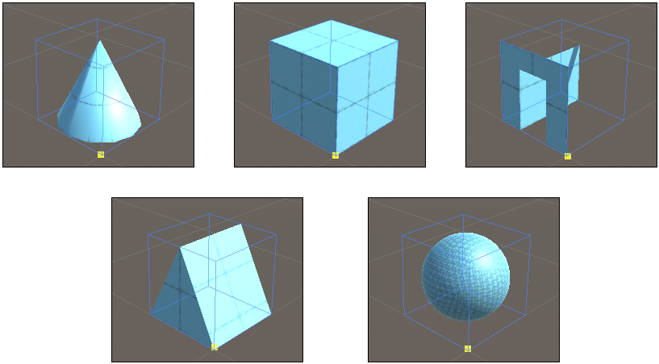
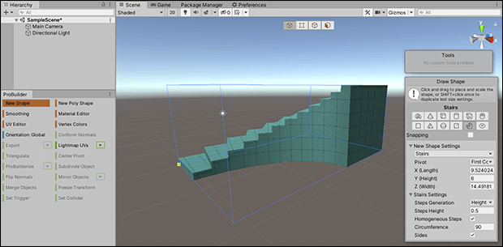

# Creating a pre-defined ProBuilder shape

Use the Shape tool to create a ProBuilder Mesh from a predefined shape primitive. ProBuilder builds these Mesh shapes inside a bounding box that you define:

The bounding box defines the size of each shape primitive using x, y, and z values relative to the "first corner" of the box: that is, the first click you make in the Scene view. If you switch between shape primitives when drawing or editing a shape, ProBuilder instantly adjusts the dimensions of the shape to fit within the bounding box.

To define the bounding box, you can either draw it in the Scene view or set the dimensions on the **Create Shape** panel and then click in the Scene view to tell ProBuilder where you want to place the new shape. ProBuilder always builds the new shape on top of any existing Mesh in the Scene or, if there is no Mesh under your mouse, on the plane defined in the [settings for Unity's Grid snapping](https://docs.unity3d.com/Manual/GridSnapping.html).

To create a Mesh from a predefined shape:  

1. Open the ProBuilder window (in Unity's top menu: **Tools** > **ProBuilder window**).

  The [Edit Mode toolbar](edit-mode-toolbar.md) and the [ProBuilder toolbar](toolbar.md) appear.

2. From the ProBuilder toolbar, click the **New Shape** () tool. The [Create Shape](shape-tool.md) panel appears in the bottom of the Scene view and the **New Shape** text button is highlighted.

  > **Tip:** You can also use the **Ctrl/Cmd+Shift+K** shortcut or use the menu (**Tools** > **ProBuilder** > **Editors** > **New Shape**) to activate the Shape tool.

3. From the top of the **Create Shape** panel, choose the icon that matches the shape you'd like to create. Any shape-specific properties appear under the **&lt;Shape&gt; Settings** section at the bottom.

4. Set the shape-specific options (width, height, radius, number of stairs) according to the type of shape. For example, the [Stairs](Stair.md) shape lets you customize the height of the steps, how curved to make them, and whether to create faces for the sides.

  

5. While the Shape tool is active, you can't use the transform tools, but you can use the camera to orbit around the new shape and zoom in and out.

6. In the Scene view, click and hold the left mouse button to draw the base of the bounding box (along the x-axis and the z-axis) and then release the mouse button to validate the base. Move the mouse up (or down) the y-axis to draw the height, and then click to finalize the new Mesh.

  > **Tip**: Alternatively, you can set all the properties on the **Create Shape** panel, including the bounding-box dimensions, and then hover over the Scene view while holding Shift to see a preview of the Mesh. When you are satisfied with how it looks and where it appears in the scene, click in the Scene view to finish creating the new Mesh.
  >
  > **Note**: If you draw the shape on an axis-aligned plane, enable auto-snapping to set a more accurate size on the defined shape than drawing freehand. Alternatively, you can move the shape by increments defined by the [Increment Snap](https://docs.unity3d.com/Manual/GridSnapping.html#grid-and-snap) value instead. For more information, see [Snapping](shape-tool.md#Snapping).

7. To modify the last shape you created, you can change the properties on the **Create Shape** panel.

8. To create copies of the last shape you created, hold Shift to see a preview of the Mesh while moving in the Scene view, and then click to build the Mesh copy at that spot. You can do this as many times as you like until you exit the tool.

9. To exit the tool, click the **New Shape** button again or select Esc.

  **Note**: If you decide later that you want to switch primitive shapes, change the size of the bounding box, or modify any of the shape-specific properties, select the Edit Shape icon  from the **Tools** panel.

After you create a Mesh shape, you can use any of the [ProBuilder editing tools](workflow-edit.md) to fine-tune or customize that shape further. For example, you can build a plain cube and then use the **Extrude Face** and **Delete Face** tools to create windows and doorways to make a house.
