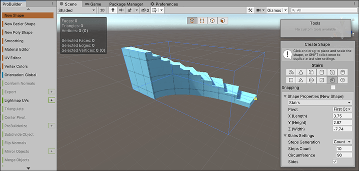

# Creating a pre-defined ProBuilder shape

To create a Mesh from a predefined shape:  

1. Open the ProBuilder window (in Unity's top menu: **Tools** > **ProBuilder window**).

  The [Edit Mode toolbar](overview-ui.md#edit-mode-toolbar) and the [ProBuilder toolbar](toolbar.md) appear.

2. From the ProBuilder toolbar, click the **New Shape** () tool. The [Draw Shape](shape-tool.md) panel appears in the bottom of the Scene view and in [Text mode](customizing.md#text-vs-icon-mode), the **New Shape** button is highlighted.

  > **Tip:** You can also use the **Ctrl/Cmd+Shift+K** hotkey to activate the Shape tool and leave the panel open, or use the menu (**Tools** > **ProBuilder** > **Editors** > **Open Shape Editor Menu Item**).

  **@DEV**: When you use the **Ctrl/Cmd+Shift+K** hotkey to activate the Shape tool, the panel stays open but the tool doesn't seem to still be active. If I activate the Edit Shape tool and do some stuff and then click the icon again to exit, the Draw Shape panel reappears. Switching back and forth between the create and edit states can also lead to tons of errors when the Shape panel is still visible, but it's hard to reproduce the error. 

3. Choose the shape you'd like to create either from the shape icons or the drop-down menu. Any shape-specific properties appear under the **&lt;Shape&gt; Settings** section at the bottom.

4. Set the shape-specific options (width, height, radius, number of stairs) according to the type of shape. For example, the [Stairs](Stair.md) shape lets you customize the height of the steps, how curved to make them, and whether to create faces for the sides. 

	 

5. While the Shape tool is active, you cannot use the transform tools, but you can use the camera to orbit around the new shape and zoom in and out. 

6. In the Scene view, click and hold as you move to draw the base of the bounding box (along the x-axis and the z-axis) and then, if you are creating a 3D shape, move up (without letting go) along the y-axis to draw the height. As soon as you let go, ProBuilder creates the new mesh.

	> **Tip**: Alternatively, you can set all the properties on the **Draw Shape** panel, including the bounding-box dimensions, and then hover over the Scene view while holding Shift to see a preview of the mesh. When you are satisfied with how it looks and where it appears in the scene, click in the Scene view to finish creating the new mesh.

7. To create copies of the new mesh you defined, hold Shift to see a preview of the mesh while moving in the Scene view, and then click to build the mesh copy at that spot. You can do this as many times as you like until you exit the tool.

8. To exit the tool, click the **New Shape** button or select Esc. 

	**Note**: If you decide later that you want to switch primitive shapes, change the size of the bounding box, or modify any of the shape-specific properties, select the Edit Shape icon  from the **Tools** panel. 

Now that you have created a Mesh shape, you can use any of the [ProBuilder editing tools](workflow-edit.md) to fine-tune or customize that shape further. For example, you can build a plain cube and then use the **Extrude Face** and **Delete Face** tools to create windows and doorways to make a house.

