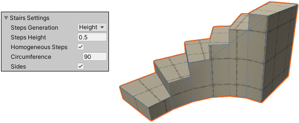

# Creating Meshes

ProBuilder provides several different tools for creating editable Meshes in Unity. 

The most common approach is to [build a predefined shape](workflow-create-predefined.md) with the [Shape tool](shape-tool.md), which includes a library of shapes. These predefined shapes include standard geometric shapes, and some more complex shapes which correspond to objects that are common in level-building. For example, the **Shape** tool provides simple cubes, prisms, toruses, and other simple geometry that you can use to create buildings, vehicles, and other objects. It also provides some convenient predefined shapes that are typically found in buildings, such as stairs, arches and doors.

 

To create predefined shapes, you can use either of the following methods with the Shape tool:

* Draw a bounding box in the Scene view. Then you can choose a primitive shape and customize it where possible with shape-specific parameters.
* Define the dimensions of the shape's bounding box on the **Create Shape** panel and customize it where possible with shape-specific parameters. Then **Shift**+click in the Scene view where you want ProBuilder to draw it.

For example, the cube shape doesn't have any shape-specific parameters, but the stairs shape lets you set the curvature, the number of steps, and whether to build sides.

If you need to make a Mesh shaped unlike any of the predefined shapes, you have several options:

- You can use the [Poly Shape tool](polyshape.md) to create a custom 2-dimensional shape and then extrude that shape into a 3-dimensional Mesh. This is a good strategy for quickly building an irregular structure, like a medieval church or a star-shaped building.
- You can use the [experimental Bezier tool](bezier.md) to define a bezier curve around which ProBuilder extrudes a Mesh. For example, you can use this tool to create tunnels with lots of twists and turns.
- You can apply an [experimental Boolean operation](boolean.md) on two or more Mesh objects to create a new object. You can choose to create just the difference between the two (Intersection), or everything but the difference between the two (Subtraction), or one big Mesh that encompasses the two original Meshes plus the space in between them (Union).

>**Warning:** Bezier shapes and Boolean operations are experimental, meaning that they are still under development, and might reduce ProBuilder's stability. Please use with caution.

Whichever method you use to create your Mesh, you can edit it using any of the [ProBuilder editing features](workflow-edit.md), [apply vertex colors](workflow-vertexcolors.md), [smooth its sharp edges](workflow-edit-smoothing.md), and [apply Materials and Textures](workflow-materials.md).

