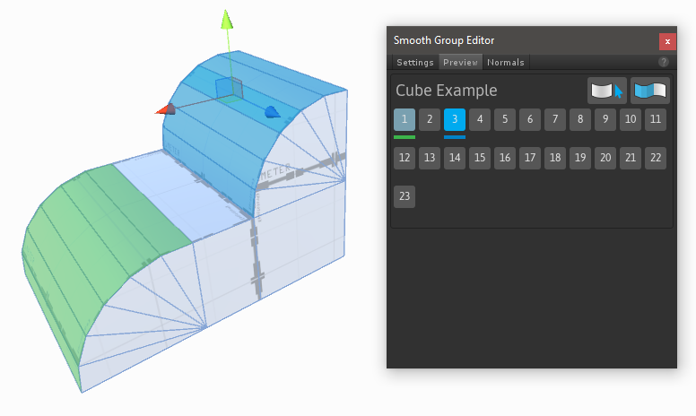

# Smooth hard edges on meshes

To make the edges between faces look smooth when lit, add those faces to a smoothing group. Faces outside a smoothing group keep hard edges.

Smoothing groups change the shading of the mesh, not its shape. ProBuilder averages the normals of the vertices that adjoining faces share, but doesn't move vertices, round edges, or add geometry. To turn sharp edges into curves, [bevel the edges](Edge_Bevel.md) or [subdivide the faces](Face_Subdivide.md) around them.

Smoothing groups work well for meshes that already have enough faces to approximate a curved shape, such as cylinders, organic shapes, curved walls, or terrain meshes.

You can do the following:

* [Create a smoothing group](#define)
* [Remove faces from a group](#clear)
* [Select all faces in a group](#select)

## Create a smoothing group

To control the degree of smoothness of complex meshes, you can define up to 30 smoothing groups for each mesh. 

To smooth a part of your mesh:

1. From the main menu, select **Tools** > **ProBuilder** > **Editors** > **Open Smoothing Editor** to open the [Smooth Group Editor](smoothing-groups.md).
1. In the **Scene** view, in the **Tools** overlay, enable the **ProBuilder** tool context.
1. In the **Tool Settings** overlay, select the **Face** editing mode.
1. Select the faces that you want to have smooth adjoining edges. Use **Shift** to select multiple faces.
1. Click an unused smoothing group number on the [Smooth Group Editor](smoothing-groups.md) window. If a group is already in use, its button [highlights in blue when you hover over it](smoothing-groups.md#preview-colors).

    > **Tip**: If you enable the **Preview** option in the **Smooth Group Editor** window, smoothing groups that are in use have a color below their respective button. This color corresponds to the color of the group in the **Scene** view.  

You can repeat these steps using different number buttons to create more groups.

## Remove faces from a group

To clear selected smoothing groups:

1. Select the faces you want to clear.
1. In the Smooth Group Editor window, select  **Clear Smoothing Group**.

## Select all faces in a group

To select all faces matching the current smoothing group index, in the Smooth Group Editor window, select  **Select Faces**.