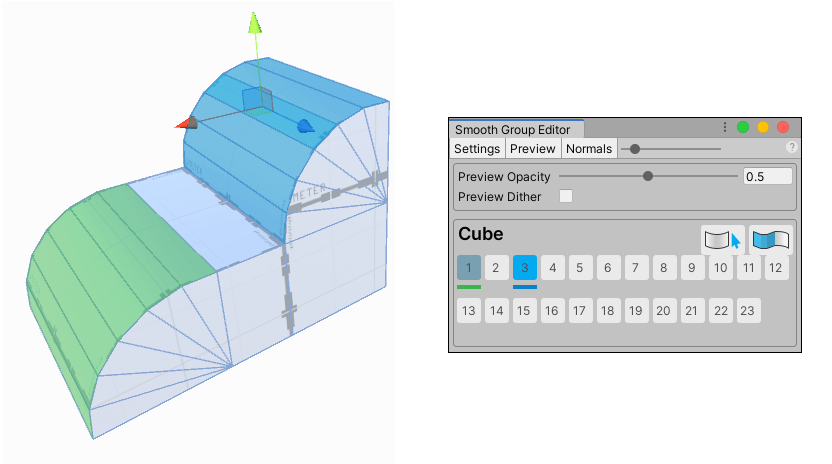

# Smoothing hard edges on Meshes

You can define **Smoothing Groups** to create a smooth and rounded look on part or all of your Mesh. If you include only a portion of your Mesh, the rest has more of a sharp and hard-cornered look.

Smoothing does not subdivide the Mesh: it controls whether vertices are split for hard edges. This often works well for simpler Meshes, so it's great for anything that is isn't simple, chunky geometry. For example, you can use this on cylinders or more organic shapes, on curved walls, or on Mesh terrain chunks.

> **Note:** This produces a fairly subtle smoothing. If you need something that turns sharp edges into smooth curves, you need to either [bevel those edges](Edge_Bevel.md) or [subdivide the faces](Face_Subdivide.md) around them for greater control.

Some of the tasks you can perform include:

* [Defining a smoothing group](#define)
* [Removing smoothing groups](#clear)
* [Selecting faces in the groups](#select)

## Defining a smoothing group

You can define up to 23 groups per Mesh in order to control the degree of smoothness.

To smooth a portion of your Mesh:

1. Select the **Face** editing mode from the [Edit Mode toolbar](edit-mode-toolbar.md).

2. Select the faces that you want to have smooth adjoining edges.

3. Click the  **Smoothing** action from the [The ProBuilder toolbar](toolbar.md).

4. Click an unused smooth group number on the [Smooth Group Editor](smoothing-groups.md) window.

	> **Tip:** Smooth groups already in use appear with a light blue highlight on the button.

	The selected faces now appear smoother.

You can repeat these steps using different number buttons.

## Removing smoothing groups

To clear selected face smoothing groups:

1. Select the faces with the group defined.
2. Click the  Clear Smoothing Group button on the [Smooth Group Editor](smoothing-groups.md) window.

## Selecting faces in the groups

To select all faces matching the current smoothing group index:

* Click the  Select Faces button on the [Smooth Group Editor](smoothing-groups.md) window.