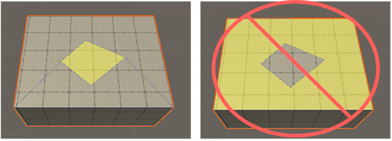

# Modeling tips for beginners

To successfully create digital models, you need to find a balance between visual quality and resource requirements. Always bear these two statements in mind:

- The less geometry you use in your Mesh, the faster your application runs. This is because every vertex, edge, or face requires computing resources.
- The more geometry you use in your Mesh, the more detailed and organic your GameObjects look. This is because more geometry means smaller polygons, which gives you more control over the shape.

One strategy you can use to find a good balance is to start with major modifications, such as [extruding](Face_Extrude.md) and [insetting](Face_Inset.md), until your Mesh is roughly the right shape. During this phase, make sure that your geometry is minimal and well-structured: use quads (four-sided polygons) or triangles whenever possible. For example, use [Insert Edge Loop](Edge_InsertLoop.md) instead of [Connect Edges](Edge_Connect.md) to keep the edges and faces as symmetrical as possible.

After you have finished the rough modeling on your Mesh, you can begin to refine it by [subdividing faces](Face_Subdivide.md) as needed. During this phase, you may decide that it is more important to achieve the correct shape quickly than to keep perfect uniformity.

Finally, when you are satisfied with the look and shape of your Mesh, you can try to remove unnecessary geometry where possible, to simplify the Mesh. You can also [remove any faces](Face_Delete.md) that are hidden behind Meshes or simply beyond the reach of the Camera. You can [merge faces](Face_Merge.md) to reduce the number of edges Unity has to process, and [collapse](Vert_Collapse.md) or [weld](Vert_Weld.md) extra vertices. 

**Note**: Make sure when you merge faces that the remaining geometry is still well-formed. For instance, if you use the [Cut](cut-tool.md) tool to create a sub-face in the middle of an existing face, don't remove the edges that connect the new sub-face to the original face's edges because this could result in degenerated faces and broken geometry. 

# Ideal geometry

When you create buildings and other architectural structures, you can use Unity's grid snapping to help you stick to right angles and perfect lines. It also makes you less likely to accidentally move vertices past an adjacent vertex, which would create realistically impossible geometry.

To make it easier to combine pieces of your buildings together later on, only use only 90-degree and 45-degree angles when building, and avoid unusual or unrealistic angles. For example, if you build the shell of a house as one Mesh and a staircase as a second Mesh, it is easier to fit the two together if they are aligned perfectly.

# Structures to avoid

Try to avoid creating structures that contain vertices in irregular locations:

- [T-Junctions](#tjoint)
- [Floating vertices](#floatv)

## T-Junctions

If you can avoid vertices at T-junctions, that makes your geometry a lot cleaner:

Notice the edge that splits only the top into two faces and does not continue into the front (the purple face). ProBuilder created the vertices at either end of this edge during a [Connect Edges](Edge_Connect.md) action. 

To avoid this complexity, the [Insert Edge Loop](Edge_InsertLoop.md) action creates edges all the way around the object, so that there are no T-junctions.

## Floating vertices

Another structural issue to avoid is a floating (or winged) vertex:

This vertex is only connected to one edge. ProBuilder left it behind after a [Merge Faces](Face_Merge.md) operation. It adds to the complexity of the geometry, but it doesn't define any connections, so ProBuilder isn't using it.

To fix a floating vertex, select the floating vertex and an adjacent vertex, then run the [Collapse Vertices](Vert_Collapse.md) tool with the **Collapse To First** option enabled. Make sure you select the vertex you want to keep first.

