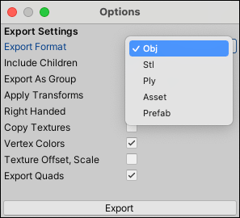

# Exporting and re-importing

If you want to use a ProBuilder Mesh in another program, such as a 3D modeling application, you can use the **Export** action to save it to one of the supported formats. For example, you might be using a ProBuilder Mesh as a placeholder while greyboxing, but eventually want to create or enhance a complex Mesh.

You can also export your ProBuilder Mesh to the Unity `.asset` format and re-import it to use as a Prefab or spawn it in the Scene. 

> **Caution:** When you export a ProBuilder Mesh to file, remember that if you want to re-import and use ProBuilder tools and actions on it, you need to [ProBuilderize](Object_ProBuilderize.md) first.

This section provides information on which formats are available, how to export ProBuilder objects to file, and also some tips for re-importing back into Unity.

## Supported formats

ProBuilder allows you to export GameObjects to the following formats:

| **Format:** | **Description:**                                           |
| :------------ | :----------------------------------------------------------- |
| `OBJ`         | Wavefront OBJ. This is a widely supported model format. It supports multiple Textures and Mesh groups. |
| `STL`         | A widely supported format, generally used in CAD software or 3D printing. It only supports Triangle geometry. |
| `PLY`         | Stanford PLY. Generally supported and very extensible. It supports quads and vertex colors, but not multiple Materials. |
| `Asset`       | Unity Asset format, only readable in Unity.                  |

## Exporting a ProBuilder Mesh

To export one or more objects to one of the [supported formats](#formats):

1. Select the object(s) you want to export.

2. **Alt/Opt+Click** over the **Export** button.

  The [Export Options](Object_Export.md) appear.

3. Select the [format you want to export to](#export) from the **Export Format** drop-down menu.

  The other Export options change depending on which format you selected.

  

4. If you're exporting an OBJ to use in Unity, disable the [Copy Textures](Object_Export.md) option. 

	> **Tip:** When you re-import the Mesh, follow the instructions under [Re-importing an exported Mesh](#reimport).

5. When you are finished setting the Export options, click **Export**.

6. Use the file browser to save the exported 3D Model.

## Re-importing an exported Mesh

When you import the OBJ format, select the 3D Model file from the Project view, and on the [Material tab](https://docs.unity3d.com/Manual/FBXImporter-Materials.html) of the **Model Import Settings** window, set the following options:

- Choose **Use Embedded Materials** from the **Location** drop-down menu.
- Inside the **Remapped Materials** section, expand the **On Demand Remap** option group.
- Choose **From Model's Material** from the **Naming** drop-down menu.
- Choose **Project-Wide** from the **Search** drop-down menu.