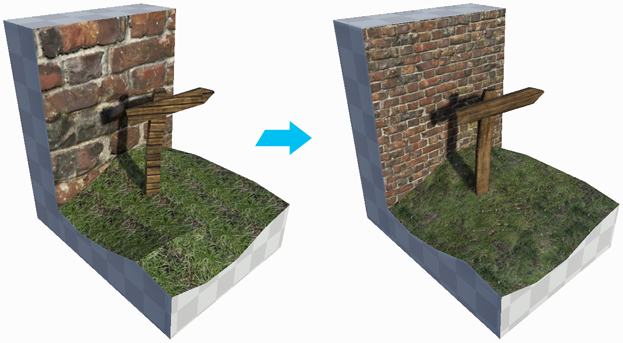

# Materials, Shaders, Textures, and UVs

In Unity, [materials](https://docs.unity3d.com/Manual/class-Material.html) allow you to specify which shader to use on a Mesh. [Shaders](https://docs.unity3d.com/Manual/Shaders.html) perform a set of calculations that tell Unity how to render (draw) your Meshes based on properties specific to that shader. 

You can apply materials to make your floor look like it's made of tile, wood, stone, or anything else that you want. ProBuilder allows you to [apply a material](workflow-materials.md) to the entire Mesh, or only on selected faces. This allows you to provide more realistic-looking surfaces during game play or while grey-boxing. For example, you might decide to use tiles on the floor, brick on some walls, and stone on others.

Some materials use [Textures](https://docs.unity3d.com/Manual/Textures.html), which are bitmap images (for example, Unity can import BMP, JPEG, PNG, and most standard 2-dimensional image formats). Unity projects these images on the surfaces of your Mesh to achieve a more realistic result. 

The Mesh stores the texture mapping data as UVs. These are 2D fold-outs of the actual 3D Mesh, as if you peeled back the skin of an object and laid it out flat, like the image below.

UV coordinates (also sometimes called texture coordinates) are references to specific locations on the image. They only use two dimensions (u,v). Texture mapping is the list of 2D UV coordinates mapped to their 3D vertex counterparts on the surface in three dimensions (x,y,z). This mapping tells Unity exactly how and where to project the image on the Mesh.

> **Note:** For more in-depth information on these concepts and the relationship between rendering and GameObjects in Unity, see [Materials, Shaders &amp; Textures](https://docs.unity3d.com/Manual/Shaders.html) in the Unity User Manual.

The [Smooth Group editor](workflow-edit-smoothing.md) lets you smooth the seams on portions of your Meshes and leaves others sharper. This can be very useful when creating organic Meshes, such as terrain objects.

For [Materials containing Textures](workflow-materials.md#texmat), you can use ProBuilder's [texture mapping](workflow-texture-mapping.md) to fine-tune the appearance. For example, if you apply a brick material to a wall, you can adjust the offset, rotation, and tiling of the object's UVs. 

This image shows the Textures before adjustments on the left and after adjustments on the right. On the right, the brick Texture is scaled down and tiled on the wall Mesh, and the wooden Texture is rotated to match the alignment of the signpost Mesh, so that the grain appears to be moving in a natural direction. The grass Texture on the right has been repositioned and [smoothed](smoothing-groups.md).

