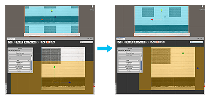
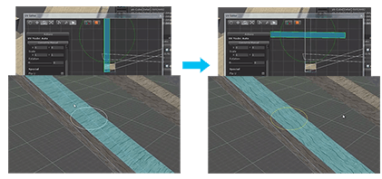
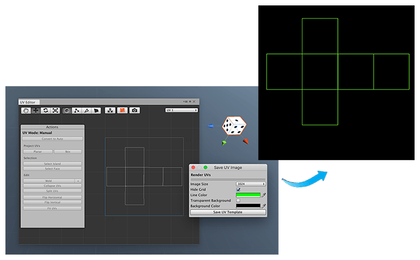

# Mapping Textures with UVs

To give your walls, doors, floors, or other objects a realistic look, use a Texture Material, which is just a special Material with a 2-dimensional image defined on it. You can [create it yourself](workflow-materials.md#texmat) or [download one from the Asset Store](https://docs.unity3d.com/Manual/AssetStore.html).

After you [apply the Texture Material](workflow-materials.md#apply), open the UV Editor to fine-tune the look of the Texture on your Mesh and adjust its appearance. The UV Editor window provides several texture mapping tools to help you get the position, orientation, and size just right.

> **Tip:** Before you start to manually edit UVs, delete any hidden faces. This helps simplify the UV unwrapping process, because it simplifies the complexity of the UV elements that appear in the UV Editor.

## Manipulating UV elements in the UV Editor

You can manipulate elements with the [ProBuilder edit modes](edit-mode-toolbar) in the UV Editor, but you are actually moving UI elements rather than geometry. In addition, when the UV Editor window is open, you can still manipulate elements in the Scene view: if you turn on the  Scope control, you are moving geometry; if you turn it off (), you are moving UVs.

You can [translate, rotate, and scale](https://docs.unity3d.com/Manual/PositioningGameObjects.html) elements to move them into place:

* **Translating** allows you to align the UVs to the geometry. For example, if you have a wall with a window, you might need to move the Texture image so that the window image appears at the right height on your wall. 

	 

* **Rotating** turns the image being projected on the skin of the Mesh. For example, if you have an object that is made of wood, you need to line up the grain of the wood in the Texture image with the geometry in a way that makes it look natural.

	 

* **Scaling** changes the size of the projection, so when you scale the UV elements down, a smaller portion of the image appears on the Mesh. For example, you might have a barrel image that contains the sides of the barrel on one half and the lid and bottom on the other half. 

	 

> **Tip:** If you hold down the **Ctrl/Cmd** key while translating in the UV Editor window, the UV element snaps to the grid.

## Auto UV mode features

ProBuilder's **Auto UV** mode provides some basic settings and then uses that information to project the Texture image on the Mesh automatically. You can determine how ProBuilder should [treat the image](auto-uvs-actions.md#tiling-amp-alignment): repeat it, enlarge it, or distort it to fill the space.

You can also use the transformation controls to translate, rotate, and scale UV elements, or [use precise values](auto-uvs-actions.md#Transform) with the **Offset** (**Translate**), **Rotation**, and **Tiling** (**Scale**) values. There are also a couple of shortcuts to [flip the UVs](auto-uvs-actions.md#special).

> **Tip:** If something goes wrong with your UV mapping, and using Undo a few times doesn't fix the problem, you can always reset the UVs on a specific face and start again. To reset the UVs, select the face(s) you want to fix, navigate to the Auto UV mode **Actions** panel, and click the **Reset UVs** button.

After you specify these guidelines, ProBuilder keeps the image projections consistent. Even if you change the geometry, you don't have to adjust or reposition the UVs.

### Continuous tiling

When you work in Auto UV mode, you can designate several faces as a [Texture Group](auto-uvs-actions.md#Groups). The faces inside a Texture Group behave as if they are one face for tiling.

#### To make a Texture Group

1. Open the UV Editor. 
2. Select the faces you want to group, either from inside the UV Editor or in the Scene view. 
3. Click the [Group Selected Faces](auto-uvs-actions.md#Groups) button. In the UV Editor, the UV faces now move as one.  

#### To add a face to an existing group

This procedure is the only way to add a face to an existing group without having to break the group and reform it from scratch. If you select the group and the new face and click **Group Selected Faces**, ProBuilder creates a new group containing the selection.

1. Note the [Texture Group](auto-uvs-actions.md#Groups) ID under the **Texture Groups** section.
2. Select the face(s) you want to add to the group. If this face already belongs to a group, a different number appears in the **Texture Group** text box. Otherwise, the default number (0) appears to indicate it is not assigned to any Texture Group.
3. Enter the ID number of the desired group in the **Texture Group** ID text box. 

> **Note**: This does not add the rest of the Texture Group to the selection. 

#### To select all the faces in a Texture Group

1. Select any of the faces that belongs to the group.
2. Click the [Select Texture Group](auto-uvs-actions.md#Groups) button.

#### To remove a Texture Group

This procedure removes any group that any of the selected face(s) belongs to.

1. Select any of the faces that belongs to the group.
2. Click the [Break Selected Groups](auto-uvs-actions.md#Groups) button.

## Manual UV mode features

Any time you modify edges or vertices in the UV Editor, you enter the **Manual UV** mode. You can also select the face(s) you want to set as manual, and click the **Convert to Manual** button instead. The Actions panel provides a completely different set of tools, and the UV Editor displays manual faces as yellow or orange in the UV Editor, whereas automatic faces appear turquoise or blue.

To start manually editing UVs, choose between the [box and planar](manual-uvs-actions.md#Project) projection modes. This difference between these is that **planar** projects the image from a single point across all faces, while the **box** method uses a planar projection for each face.  

When you've done this, you can use the transform tools to move, rotate, and scale UV elements, with the auto-snapping (**Ctrl/Cmd+translate**) hotkey combination where needed. The [Fit UVs tool](manual-uvs-actions.md#fit-uvs) shrinks or grows your UV face uniformly. You can also move faces into place, and then select either the vertices or edges and weld them together to make an [island](manual-uvs-actions.md#Edit). 

If you need to change the shape of the UV face, move the vertices and edges directly. Alternatively, you can use the [auto-stitch](manual-uvs-actions.md#autostitching) method to make ProBuilder build more islands. If you need to break them apart again, select each face you want to break off, then click the [Split UVs](manual-uvs-actions.md#split-uvs) button. Now you can move them around independently.

You can temporarily change the pivot location; to do this, click and drag it around in the UV Editor. The pivot is the reference point for scaling and rotating. Changing the pivot location is only a temporary change: if you click something else and then re-select it, it snaps back to the center.

To mirror the UV mapping on a face, you can [flip the UVs](manual-uvs-actions.md#edit) either horizontally or vertically. You can also [copy the UV mapping](manual-uvs-actions.md#copy-uvs) from one face to another. 

> **Tip:** If something goes wrong with your UV mapping and using Undo a few times doesn't help, you can always reset the UVs on a specific face and start again. To reset the UVs, select the face(s) you want to fix, switch to Auto UV mode, navigate to the Auto UV mode **Actions** panel, and click the **Reset UVs** button.

## Common texture mapping tasks

This section describes some of the most common ways you can use the ProBuilder texture-mapping tools. There any many more possibilities, but these should give you a good place to start developing your own workflow.

* **Wooden beams**: Select the UV face(s) and [rotate them in Auto UV mode](auto-uvs-actions.md#Transform) until the grain goes down the length of the beam. With the UV Editor open, you can select all faces at once in the Scene view by double-clicking on any face on the object.

* **Stone or tile pathway**: Depending on the length and crookedness of your pathway, you could: 

	* [Autostitch](manual-uvs-actions.md#autostitching) the pieces together to create one large unwrapped UV map and then [apply the stone or tile Material](material-tools.md) with a [Planar projection](manual-uvs-actions.md#planar).
	* Select a face, [grow the selection](Selection_Grow.md) until all of the pathway is selected, and then apply the Material. If needed, you can then [tweak the UV alignment](auto-uvs-actions.md#Transform) on the selected UV faces.

	You can also select a group of faces and tweak the placement in either mode to get the final look just right. 

* **Brick or stone walls**: For objects that you want to make continuous, like walls, use the [Auto UV mode](uv-editor.md#uv-editing-modes). Start by selecting one of the faces on the side of the wall and [grow the selection](Selection_Grow.md). Then you can [scale the UV faces](auto-uvs-actions.md#Transform) up so that the pattern tiles more (for smaller bricks), or down to tile less (bigger bricks). 

	To tile across adjacent faces perfectly, [group the faces together](auto-uvs-actions.md#texture-groups). Avoid including the corners, because they can create a stretch effect.

	If you prefer to use manual editing, you could use [autostitching](manual-uvs-actions.md#autostitching); start from the sides all around, and then finally add the tops. This makes the tiling around the corners look more natural. However, because this is the Manual UV mode, you have to re-position the UVs if you resize the geometry.

* **Wooden barrels**: You can use a Texture that uses different portions of the same image file to define the top, bottom, and sides. First, [autostitch](manual-uvs-actions.md#autostitching) all the side faces together. This automatically changes the autostitched faces to use [Manual UV mode](uv-editor.md#uv-editing-modes).

	Next, you can move those faces by translating, and if you hold the **Shift** key while translating, the UVs [snap to the grid](hotkeys.md#uv-snap). Scale up or down to fit the height exactly. You don't have to worry about the width, because the image wraps around the faces that are off the image.

	Finally, you can use the same methods to align and scale the barrel's top and bottom so that it appears exactly in the right place for the barrel image.

* **Wooden crate**: Add a [heightmap](https://docs.unity3d.com/Manual/StandardShaderMaterialParameterHeightMap.html) to your Texture to give the illusion of extra geometry. You can set up one side and then [copy those UV settings](manual-uvs-actions.md#copy-uvs) over to other faces. The [Manual UV mode](uv-editor.md#uv-editing-modes) is best for objects like these.

### Finding more inspiration

Use the Unity ProBuilder channel to find lots of videos that demonstrate how to use the tools effectively:

* [ProBuilder Simple Objects - Crates and Barrels](https://www.youtube.com/watch?v=lmLG4nC9tm0)
* [Prototyping a "Medieval House" in Unity with ProBuilder3D](https://www.youtube.com/watch?v=xEEUhSyrq7M)
* [ProBuilder Simple Texturing with AutoUVs](https://www.youtube.com/watch?v=bigj13SU1rs)
* [ProBuilder Advanced Texturing with Manual UVs](https://www.youtube.com/watch?v=d3_2h4cN4cY)
* [ProBuilder Tutorial 5: Texturing Part I - Materials and Vertex Colors (v2.3, Unity)](https://www.youtube.com/watch?v=m085rEQmVP8)
* [ProBuilder Tutorial 6: Texturing Part II - UV Editing and Unwrapping (v2.3, Unity)](https://www.youtube.com/watch?v=U_5f8RlciWQ)

 

## Creating a UV template

ProBuilder can render out a UV template that allows you to open it in an image editing program and customize your Texture for the shape you need.

1. Open the UV Editor.
2. Click the Camera icon (). 
3. [Save UV Image](uv-editor-toolbar.md#Texture) window pops up
4. You can [customize the appearance](uv-editor-toolbar.md#SaveUV) of the template, such as the color of the template lines or the size of the image file.  
5. Click **Save UV Template** and choose where you want it to save the file. ProBuilder creates a PNG file displaying a black background and lines etching the shape of the template.

Now you can open it in an image editing program and create or refine the Texture image in exactly the right dimensions.

 

