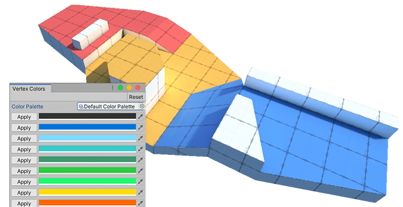

# Setting vertex colors

Applying vertex colors is a great way to colorize levels for prototyping, team layout, zones, and more. You can apply unique vertex colors to faces or objects in order to easily identify where they begin and end. You can also apply vertex colors to vertices and edges for visual effects.

> **Warning:** Not all shaders display vertex colors on a Mesh. However, you can see vertex colors on your Meshes as long as you use a Material that supports vertex colors (like the default ProBuilder Material).

## Editing modes

Depending on what [editing mode](modes.md) you are in and what you select on your Mesh, the vertex colors appear differently. For example, if you select a single vertex or edge, the color you apply is intense on that element and fades outward from it. However, if you select a face or the entire Mesh object, the color covers the face or Mesh evenly:

## Applying a color

To apply a vertex color:

1. Select the [Editing mode](modes.md) you want from the [Edit mode toolbar](edit-mode-toolbar.md).

2. Select the object(s) or element(s) that you want to apply a color to.

3. Click the  **Vertex Colors** button on the ProBuilder toolbar.

	The [Vertex Colors window](vertex-colors.md) appears.

4. Click the **Apply** button next to the color you want to apply. Alternatively, you can use the shortcut displayed on the button (**Alt/Opt+Shift+&lt;number&gt;**) or select the preset from the ProBuilder menu (**Tools** > **ProBuilder** > **Vertex Colors** > **Set Selected Faces to Preset &lt;number&gt;**).

> **Note:** To remove a vertex color, apply the white vertex color (**#FFFFFF**).
