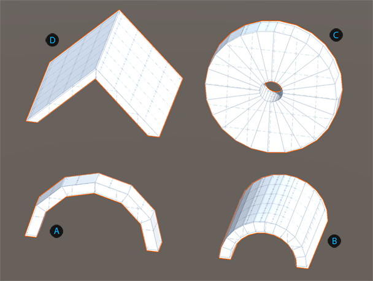
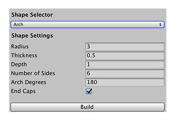

# Arch
The basic arch shape is  a curved symmetrical shape (see **A** in the image below). You can customize the basic arch shape to create tunnels, pipes, roofs, and many other objects.

 Basic arch shape (default values)

 Tunnel: Arch with increased depth and thickness

 Wheel: Arch with increased number of sides, thickness and degrees (and no end cap)

 Roof: Arch with 2 sides and increased depth

When you customize an arch shape, keep in mind that when you change the thickness and number of sides, it is relative to the **Radius** and **Arch Degrees** values. For example, two arches with the same thickness (15) but where one arch has twice the radius as the other (3 vs. 6), look very different. The one with the smaller radius appears much smoother than the other.

You can customize the shape of an arch with these shape properties:

| **Property:** | **Description:** |
|:-- |:-- |
| __Radius__ | Set the radius (size) of the arch in meters. A change in radius affects the overall height. The default value is 3. |
| __Thickness__ | Set the thickness of the arch in meters. As this value approaches the __Radius__ value, the smaller the _doorway_ becomes. The default value is 0.5. |
| __Depth__ | Set the depth for the arch in meters. The higher the value, the longer the _tunnel_ effect. The default value is 1. |
| __Number of Sides__ | Set the number of sides for the arch. The more sides you use (relative to the size of the __Radius__), the smoother the arch becomes, so the closer you get to a semi-circle. Conversely, if you this value to 2, the arch turns into a peaked roof, regardless of the radius. The efault value is 6. |
| __Arch Degrees__ | Set the circumference of the arch in degrees. For example, an arch of 360 degrees is circular. The default value is 180. |
| __End Caps__ | Enable this option to create faces for the ends of the arch (default).  Disable this option if you know the ends are not visible to the camera (this is an [optimization strategy](workflow-edit-tips.md) that reduces the number of polygons that Unity has to render). |
