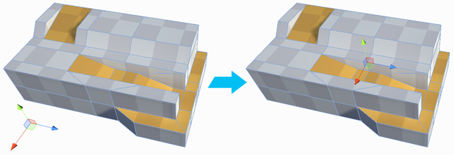

#  Center Pivot

The __Center Pivot__ tool moves the pivot point for the Mesh to the center of the object’s bounds. For example, if you move a lot of vertices on one side of your Mesh, when you try to rotate the object, it rotates around a point outside of the Mesh. 

> **Note:** If you have multiple objects selected, each object's new pivot point becomes the center of each object, regardless of the position of any other object. 
