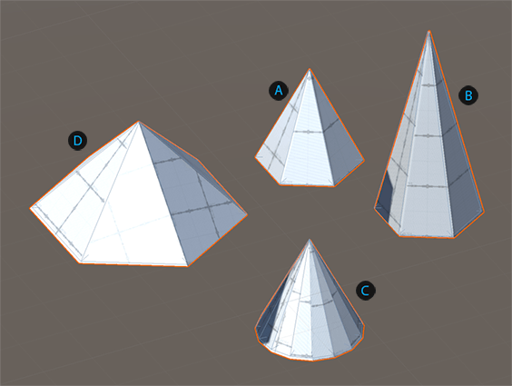
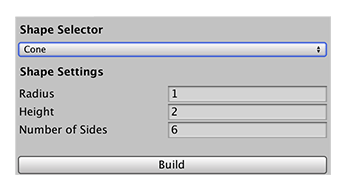

# Cone
You can make a cone shape with a wide base, or a tall thin cone, or a smoother look.

 Basic cone shape (default values)

 Cone with increased height

 Cone with increased number of sides

 Cone with wide radius

You can customize the shape of a cone with these shape properties:

| Property: | Description: |
|: |: |
| __Radius__ | Set the radius (size of the base) of the cone. Default value is 1. Minimum value is 0.1. |
| __Height__ | Set the height for the cone. Default value is 2. Minimum value is 0.1. |
| __Number of Sides__ | Set the number of sides for the cone. The more sides you use (relative to the size of the __Radius__ and the __Height__), the smoother the sides of the cone become. Default value is 6. Valid values range from 3 to 32. |
